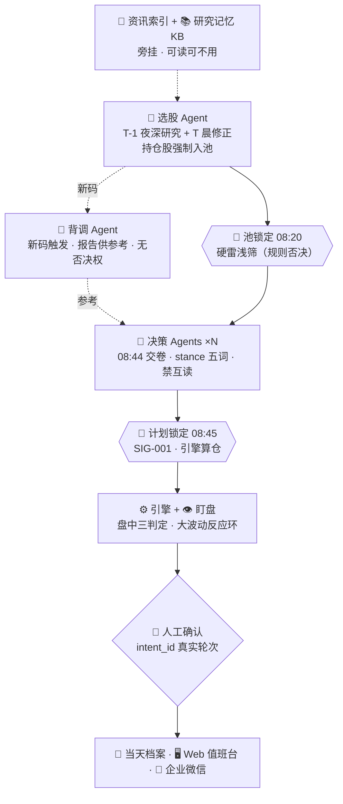

# ARCHITECTURE

> A股值班台：基于 LangGraph Deep Agents 的多智能体 A 股值班系统。
> **研究在盘后、决策在盘前、执行保护在盘中、复盘在盘后。**
> LLM 只产判断不碰钱，每笔订单人工确认，全过程落档案、可回放、可检索。

## 1. 三层权限模型

系统的边界不是「模型够不够聪明」，而是**什么不该交给模型**。三条权限链互不重叠：

| 层 | 成员 | 能做什么 | 不能做什么 |
|---|---|---|---|
| 判断层 | `screener` `news` `diligence` `decision-*` `review` `watch` `director` | 产观点、产候选、产 stance、产人话文档 | 不产任何仓位字段、不写库、不挂钟 |
| 确定性层 | `engine` | 门禁、聚合、算仓、状态机、账本、定时、推送 | 不做任何语义判断 |
| 放行层 | `human` | 唯一确认口（`intent_id` 真实用户轮次） | —— |

**取证自由，采信有门槛**：判断层在工具白名单 + 配额内自由检索（超配额只能诚实打 `LOW_INFO`），
但进入结论的每条证据必须带 `[source@time]` 并过时效门槛；不合规不静默丢弃，而是**整份作废**。
唯一的读取硬约束是防锚定的两条：决策实例之间禁互读、复核禁读 `DECISION-*.md`。

## 2. 主链



两道 🧊 冻结墙（08:20 池锁定 / 08:45 计划锁定）是主链的结构性节点：墙之后，任何会话无权加候选、
定仓、改触发线——代码层表现为 `Pool` / `Plan` 均为 frozen dataclass。

## 3. 一天节奏

| 时刻 | 动作 | 执行者 |
|---|---|---|
| T-1 23:30 | 选股深研究 → `POOL-DRAFT.md` + 新码清单 | screener |
| T-1 23:40 | 新码背调（夜 ≤2 只，10 交易日有档复用） | diligence |
| T 07:30 | 服务幂等启动 | engine |
| T 07:55 | 导演开机派活；采集脚本产 `PACK.md`；资讯索引 | director / engine / news |
| T 07:55–08:20 | 选股修正 → `CANDIDATES.md`（持仓股强制入池） | screener |
| T 08:00–08:44 | 隔夜突发新码晨补背调（≤2，其余标 `无背调`） | diligence |
| **T 08:20** | **🧊 池锁定**：edge gate + 硬雷浅筛 | engine |
| T 08:20–08:44 | 决策 ×N 并行交卷 `DECISION-{tag}.md` | decision-* |
| **T 08:45** | **🧊 计划锁定**：SIG-001 扫描 → 聚合 → 算仓 → `MORNING.md`；发微信决策卡 | engine |
| T 08:45–09:15 | 复核（禁读 DECISION）→ `REVIEW-{tag}.md`；导演写 `PLAN.md`+`CROSS_EXAM.md` | review / director |
| T 盘中 5min | 腾讯快照三判定（fixture）；保护线走冻结触发线 | engine |
| T 盘中 | 盯盘 6 轮 × 5min → `INTRADAY.md`；大波动(规则) → 导演 → intraday 决策窗口 + 调频 | watch / director / decision |
| T 11:32 / 13:00 | NOON / 下午 watch（稀疏死门） | director |
| T 15:10 | 对账 | engine |
| T 15:12 | `SUMMARY.md` + `EVENTS-POSITIONS.md`；发微信日报 | director |
| T 15:30 | 备份；当日结论性档案增量 ingest 进 KB | engine / memory |

盘中反应环是**规则触发、不是 LLM 触发**：引擎算出 |Δ| ≥ 3% / 量 ≥ 5日均量 2.5 倍 / 触冻结触发线
才写 `ALERT.md` 并激活导演；导演只能派盘中决策与请求调频，不能引入新码（仅限已持仓 / 已冻结未
成交），冷却上限同标的 ≤2 次/日、全局 ≤4 次/日。

## 4. 旁挂服务（不在主链，可读可不用）

- **`PACK.md` 采集**：脚本，确定性，无 LLM。来源分级表是配置不是判断。
- **`EVENT-INDEX.md`**：`news` 把 PACK 读成「事件 → 受影响标的 → 来源 → 时间戳」。是地图不是闸门，
  下游可以不用。
- **研究记忆 KB**：只收结论性、跨日有效的档案（`SUMMARY` 结论段 / `CROSS_EXAM` / `DD/**` /
  `EVENTS-POSITIONS` / quant-lab 结题卡），**不收** time-bound 的 `DECISION-*` `CANDIDATES.md`
  `PACK.md` `EVENT-INDEX.md`（防跨日锚定），也**不用于检索行情与新闻**。

## 5. 输出面

Web 值班台（Board / Replay / Confirm / KB / Evals 五页）与企业微信四类卡片，两者**只读**引擎与档案，
不产生任何写操作；唯一例外是 Confirm 页提交——它产生一条真实用户轮次记录并调用 engine 的确认 API。
所有卡片上的数字一律来自引擎，agent 文字一律标「评论」，**卡片内不含确认按钮**。

## 6. 命名冻结

角色代号：`director` `screener` `news` `diligence` `decision`(多实例 `decision-1/2/3`) `review`
`watch` `engine` `human`。

stance 五词（序值冻结）：`清仓` -2 / `减仓` -1 / `持有` 0 / `建仓` +1 / `加仓` +2。

订单十态：`draft` `approved` `queued` `submitted` `filled` `partial` `rejected` `canceled`
`expired` `archived`。状态名是代码标识符，中文只出现在展示层。

档案文件名（`results/daily/{YYYY-MM-DD}/` 下）见 `plan.md` §2.2，一字不改。

## 7. 目录结构

```
astock-duty-officer/
├── plan.md                      # 权威规格
├── README.md ARCHITECTURE.md SAFETY.md EVALUATION.md DECISION-LOG.md
├── pyproject.toml               # uv workspace host
├── .github/workflows/{ci,lint,docs}.yml
├── app/src/duty_agent/
│   ├── graph.py planner.py config.py
│   ├── agents/{director,screener,news,diligence,decision,review,watch}.py
│   ├── guardrails/{sig001,hard_red,source_adjudicator,intent_guard}.py
│   ├── memory/{ingest,store,recall_tool,eval}.py + eval_golden.json
│   └── notify/{wecom,cards}.py
├── engine/src/duty_engine/{clock,freeze,aggregate,orders,ledger,monitor,push_dispatcher,storage}.py
├── web/{app.py,pages/{board,replay,confirm,kb,evals}.py}
├── examples/replay-2026-09-16/  # 脱敏全天档案 + fixtures/
├── scripts/check_secrets.py
└── tests/                       # 镜像 app/engine 结构
```

`engine/` 纯 Python + stdlib `sqlite3`，零 LLM、零网络；`app/` 依赖 `engine` 而非反向。

## 8. 本仓库不是什么

GitHub 求职展示用的**参考实现**：不实跑、不接券商、不联网拉真实行情，数据源 adapter 一律返回
`examples/` 里的 fixture，LLM 走 `FakeChatModel`。真实生产系统是另一个仓库，本仓库不复用其代码。
