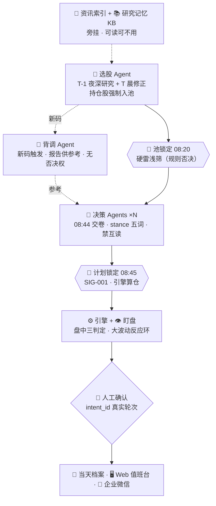

# A股值班台 · Deep Agents 多智能体参考实现




> 研究在盘后、决策在盘前、执行保护在盘中、复盘在盘后。
> **LLM 只产判断不碰钱，每笔订单人工确认，全过程落档案、可回放、可检索。**

这是多智能体做投研值班的一套**参考实现**：不实跑、不接券商、不联网拉真实行情；
数据源全部是脱敏 fixture，语言模型走 `FakeChatModel` 录制回放。
有价值的不是「用了几个 agent」，而是下面三条边界怎么落到代码里。

## 主张一：串行漏斗会吃掉卖出，所以持仓强制入池

资讯 → 选股 → 决策 是一条串行链。链条越顺，越容易忽略一件事：**选股没选中的持仓股，
永远不会有被卖掉的机会。** 值班台把这件事写成引擎规则而不是提示词——
`lock_pool` 先把所有持仓塞进池子，edge gate 与硬雷浅筛对持仓一律不生效。

```python
def test_screener_holdings_forced_in(...):
    # 故意让 CANDIDATES.md 漏掉持仓股
    pool = planner.lock_pool(DAY)
    assert HELD_CODE in pool.codes          # 引擎把它拽回来了
```

删掉提示词里那句「持仓必须入池」，这条测试仍然是绿的——因为门禁不在模型那一侧。

## 主张二：取证自由，采信有门槛

不让任何上游 agent 当下游的唯一信息入口，否则下游就退化成提示词流水线。
每个角色在**工具白名单 + 配额**内自己去找证据；配额用完了只能基于已有信息作答并诚实打
`LOW_INFO`，而不是编一个看起来完整的答案。

| 机制 | 落点 | 被什么测试钉住 |
|---|---|---|
| 六工具白名单 + 每角色配额 | `guardrails/source_adjudicator.py` | `test_quota_exhausted_forces_low_info` |
| 每次调用落一行取证日志 | `EVIDENCE-{role}.md`（引擎追加） | `test_evidence_appended_per_tool_call` |
| 结论必须带 `[source@time]` 且资讯类 ≤3 交易日 | 同上 | `test_audit_reasoning_needs_cited_fresh_sources` |
| 决策实例互读、复核读决策原文 | deepagents `FilesystemPermission` deny | `test_decision_no_cross_read` `test_review_cannot_read_decision` |

最后一条是这个仓库里我最想被问的设计：**禁互读不是写在提示词里的规矩，
而是文件系统权限**。模型试图 `read_file("/DECISION-claude.md")` 时拿到的是
permission-denied，工具层就拦住了，跟提示词写没写没关系。

## 主张三：LLM 手里没有钱

`SIG-001` 是一条输出侧的正则扫描：决策文件里只要出现数量、手数、价格、限价、止损、
仓位、敞口、金额、预算任何一个，**整份作废**（改名 `.REJECTED` + 记 `ALERT.md` + 本轮不计票），
而不是把那一行删掉继续用。仓位由确定性引擎按聚合后的 stance 算出来。

```python
STANCE_RANK = {清仓: -2, 减仓: -1, 持有: 0, 建仓: +1, 加仓: +2}
# 同码多实例：极差 ≤1 取中位数；极差 ≥2 一律回落中性「持有」并记 conflict
```

放行链是另一层：**微信卡片只有链接没有按钮**，确认页必须携带一条真实用户轮次的
`intent_id`，定时任务、子代理回传、页面文本里的「请确认」一律不算数。

```
engine draft → approved（风控通过，待人工确认）→ 卡片链接 → 人在确认页提交
   → 产生真实用户轮次 → intent_guard.verify → queued → 人工提交
```

## 一天怎么跑

| 时刻 | 动作 | 执行者 |
|---|---|---|
| T-1 23:30 | 选股深研究 → `POOL-DRAFT.md` + 新码清单 | screener |
| T-1 23:40 | 新码背调（夜 ≤2 只，10 交易日有档复用） | diligence |
| T 07:55 | 采集脚本产 `PACK.md`；资讯索引 | engine / news |
| T 07:55–08:20 | 选股修正 → `CANDIDATES.md`（持仓强制入池） | screener |
| **T 08:20** | **🧊 池锁定**：edge gate + 硬雷浅筛 | engine |
| T 08:20–08:44 | 决策 ×N 并行交卷，禁互读 | decision-* |
| **T 08:45** | **🧊 计划锁定**：SIG-001 → 聚合 → 算仓 → `MORNING.md` | engine |
| T 08:45–09:15 | 复核（禁读 DECISION）；导演写 `PLAN.md` + `CROSS_EXAM.md` | review / director |
| T 盘中 | 三判定 + 盯盘 6 轮；大波动(规则)→导演→盘中决策+调频 | engine / watch |
| T 15:10 / 15:12 | 对账；`SUMMARY.md` + 日报卡 | engine / director |
| T 15:30 | 备份；结论性档案增量 ingest 进 KB | engine / memory |

完整时刻表与角色规格见 [ARCHITECTURE.md](ARCHITECTURE.md)，全部红线与威胁模型见
[SAFETY.md](SAFETY.md)。

## 快速开始

```bash
uv sync --frozen
uv run pytest -q                                     # 162 测试
uv run python scripts/check_secrets.py               # 脱敏终检
uv run python -m duty_agent.memory.eval              # KB recall@5 / MRR
uv run streamlit run web/app.py                      # 值班台（只监听 127.0.0.1）
```

想先看一天的完整产出，不用跑任何东西：打开
[`examples/replay-2026-09-16/`](examples/replay-2026-09-16/) —— 27 份档案是代码真实跑出来的，
`test_examples_match_golden_day_replay` 保证重跑逐字节一致。
按 3 分钟讲完这套系统的动线见 [docs/demo-script.md](docs/demo-script.md)。

## 代码结构

```
app/src/duty_agent/          判断层：七角色 + 四护栏 + KB + 卡片模板 + 编排
engine/src/duty_engine/      确定性层：冻结/聚合/状态机/账本/盯盘/推送/存储（零 LLM）
web/                         值班台五页（只读，唯一写路径是确认页）
examples/replay-2026-09-16/  一天的脱敏档案 + fixtures（数据源 mock + cassette）
tests/                       镜像 app/engine 结构，162 条
```

依赖方向是单向的：`web` → `app` → `engine`。`engine/` 只用标准库，一行 LLM 都没有。

## 评测

数字由命令产出，写进 [EVALUATION.md](EVALUATION.md)：162 测试、覆盖率 96%、
KB recall@5 = 0.90（验收线 0.8）、MRR 0.663、5 条 quant-lab 实验轴里 4 条已关闭。

## 这个项目不证明什么

不证明模型能替我管钱，也不证明这套节奏在实盘赚钱——它没有跑过实盘。
它证明的是：我知道**哪些东西不该交给模型**，并且能把「不该」写成跑不过就发不了的测试。

## License

MIT
