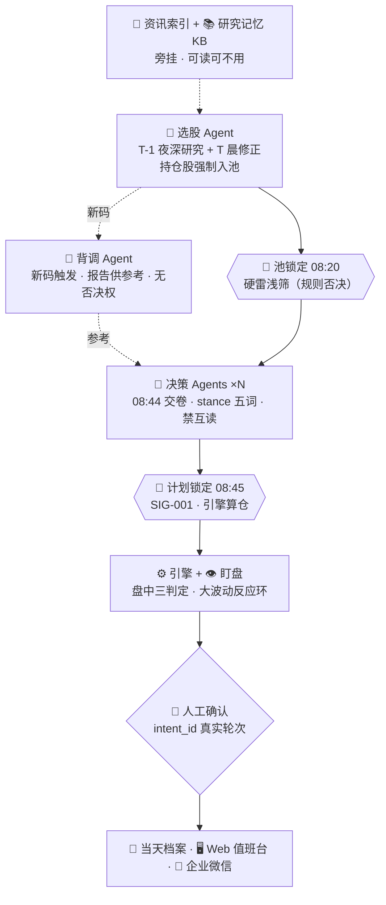

# A股值班台 · Deep Agents 多智能体参考实现

> 研究在盘后、决策在盘前、执行保护在盘中、复盘在盘后。
> **LLM 只产判断不碰钱，每笔订单人工确认，全过程落档案、可回放、可检索。**

M1 骨架阶段：完整叙事、徽章与演示动线在 M6 收尾时补齐。
现在可读的文档：[ARCHITECTURE.md](ARCHITECTURE.md) · [SAFETY.md](SAFETY.md) ·
[DECISION-LOG.md](DECISION-LOG.md) · [规格原文 plan.md](plan.md)

## 免责声明

本项目是**架构参考实现**，不实跑、不接券商、不联网拉真实行情；数据源全部为脱敏 fixture，
LLM 走 `FakeChatModel`。文中任何标的、代码、数字均为示例，不构成投资建议。
