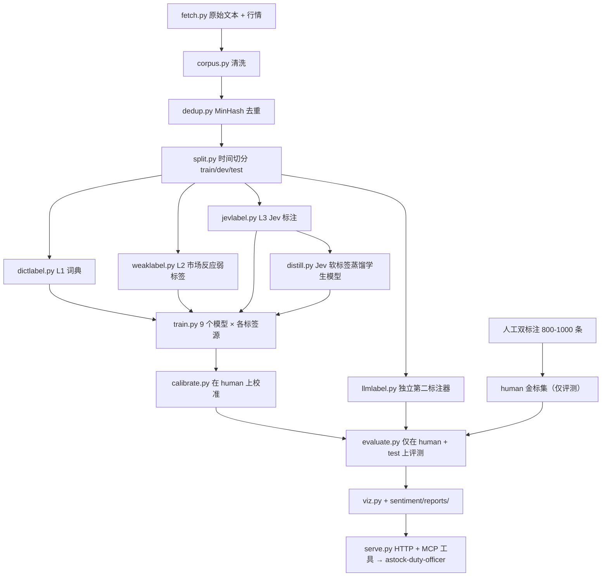

# PLAN-sentiment-v1.md — 情感子系统（利多/利空/中性打分）实施计划

> **这是 `astock-duty-officer` 的第三个 workspace 成员（`sentiment/`），不是独立仓库。**
> 上游消费者是同仓库的 `duty_agent`（决策 Agents 通过工具调用它），契约见 §7，红线见 §13。
>
> 目标岗位：Agent 开发。本子系统负责补齐「经典机器学习 + NLP/深度学习」凭据，
> 叙事定位：**Agent 系统里一个可评测、可校准、可替换的感知模块**。
> 同 portfolio 的另两个仓库：`pipeline-integrity`（统计 ML / 时序）、本仓库（Agent 编排）。
>
> **本文件由弱模型（flash 级）执行。所有命名、文件名、指标名、测试名均已冻结，不得擅自更改。**

---

## 0. 给实现者的总守则（先读，违反即返工）

1. **不要自己发明。** 本文件没写的东西，不要加。觉得缺了就停下来写进 `sentiment/docs/QUESTIONS.md`，不要猜。
2. **不要改冻结命名。** §2 的模块名、指标名、文件名、测试名、标签名、标签源名一字不改。改名 = 下游全部失效。
3. **不要跳里程碑。** M0→M6 严格按序。每个里程碑末尾有「验收命令」，跑不通不许进下一个。
4. **不要美化数字。** §13.1 是最高红线。跑输了就写跑输了，附上完整表格。任何"调参调到刚好过线"而不记录的行为，视为造假。
5. **不要用外部 API 的结果当真值评测自己。** Jev 标的标签训出来的模型，**绝不允许**在 Jev 标注的集合上评测（§13.2 循环偏差红线）。
6. **不要引入白名单外依赖。** §8。特别是：不许用 `fastdtw`/`dtaidistance` 之类替代实现，不许引入本文件未列的 LLM SDK。
7. **不要把数据写进代码。** 所有路径、阈值、切分比例进 `sentiment/configs/*.yaml`，代码只读配置。
8. **不要提交原始新闻全文到公开仓库**（版权）。§14 脱敏规则。
9. **每次改动跑 `pytest -q`**，测试只允许新增，不允许删除或 `skip`。
10. **所有随机过程固定种子**，`SEED = 20260921`，写进 `sentiment/configs/base.yaml`，任何脚本不得硬编码别的种子。

---

## 1. 项目性质与验收总览

### 1.1 一句话定义

给定一条中文金融文本（新闻标题+正文 / 股吧评论 / 公告摘要），输出
`(label, probability, strength, is_stock_specific, evidence, provenance)`，
其中 `label ∈ {利空, 中性, 利多}`，`probability` 为**经人工金标集校准后的**三分类概率。

### 1.2 本项目的真正产出（面试叙事，务必理解后再动手）

产出**不是**"我们训了一个 BERT 达到 xx% 准确率"。产出是四件事：

| # | 产出 | 为什么有价值 |
|---|---|---|
| P1 | **无外部依赖的完整经典 ML 阶梯**（词典 → TF-IDF+LR/RF/LightGBM → FastText/TextCNN → BERT/FinBERT），全部用市场反应弱标签训练 | 这是"Jev 出现之前"就该做完的工作。可复现、零 API 成本、是简历上的经典 ML 凭据 |
| P2 | **标签源消融实验**：同一分类器 × 4 种标签源（词典/市场反应/Jev/人工）→ 在独立金标集上对比 | 回答"便宜标签到底买了什么"。这是本项目的方法论贡献 |
| P3 | **Jev 作为蒸馏教师**：Jev 标 5 万条 → 蒸馏出自有学生模型 → 学生离线免费推理 | 回答"为什么不直接调 Jev"：成本、延迟、可用性、可复现性 |
| P4 | **校准层 + 采信门槛**：Brier/ECE/可靠性曲线/温度缩放，输出概率可直接被 Agent 的采信门槛消费 | 回答"Agent 怎么用它"：Agent 不需要标签，需要**能比较的、校准过的概率** |

**禁止的表述（README / 简历 / 面试口径，违反即返工）：**

> ❌ "用 Jev 替换 BERT，性能提升 X%"

三条理由，写下来是为了让你在被问到时答得上：

1. **方向反了。** 这句话传递的信号是"我不训模型，我调 API"。本子系统真正的差异化是：
   你有完整的自建阶梯（P1），**然后基于成本与可复现性选择用 Jev 蒸馏**（P3）。
2. **大概率不是真的。** 第三方实测中 Jev 零样本冷启动相关性仅 0.210–0.435，
   约等于用 150–500 条人工标注训出的模型。在 3.5 万条市场反应弱标签上微调过的 BERT，
   很可能直接打赢 Jev 零样本。写出"提升 X%"，被追问"真值是什么、怎么测的"就会塌。
3. **消融表可能显示 Jev 标签是输的。** §6.2 的主表允许并预期出现这种结果（§13.1 第 3 条）。

> ✅ 允许的表述："**用 Jev 标注 __ 万条并蒸馏出自有离线学生模型，标注成本降低 __×，
> 推理离线零成本，F1 保留 __%；同时在 4 种标签源 × 9 个模型的消融中量化了便宜标签的边界。**"

### 1.3 验收总览

项目完成 = 以下全部为真：

- [ ] `uv run python scripts/run_all.py --backend synthetic` 一条命令从零跑通 MS0→M6（合成数据模式，不依赖任何外部 API 与真实数据）
- [ ] `sentiment/reports/label_source_ablation.md` 存在，含 4×9 完整矩阵，**包含 Jev 输给经典基线的行**（如果有），含「诚实记录」小节
- [ ] `sentiment/reports/jev_agreement.md` 存在，含 Jev-vs-人工 κ、Jev-vs-市场反应混淆矩阵、分歧样本 Top-50 人工复核结论、≥10 条 Jev 失败案例
- [ ] `sentiment/reports/calibration.md` 存在，含校准前后 Brier/ECE 对比与可靠性曲线图
- [ ] `sentiment/reports/cost_frontier.md` 存在，含 成本(元/千条)–F1 帕累托前沿图
- [ ] `sentiment/docs/LEAKAGE.md` 存在，逐条说明时间切分、跨切分去重、预训练污染三项防护的实测结果
- [ ] **集成验收**：`tests/sentiment/test_tool_contract.py` 全绿，且 `uv run python -c "from duty_agent.tools import sentiment_tool"` 不报错
- [ ] **集成验收**：`examples/replay-2026-09-16/EVIDENCE-news.md` 中出现 `[sentiment@bert_wwm_distill]` 形式的引用标记
- [ ] `uv run pytest -q` 全绿（含原有 engine/agent/memory/output 测试，不得回归）
- [ ] 根 `README.md` 增补情感子系统一段 + 消融主表内嵌；`ARCHITECTURE.md` 增补 `sentiment/` 包说明
- [ ] 全仓库不出现 §1.2 禁止表述（`scripts/check_claims.py` 通过）

---

## 2. 命名冻结表

### 2.1 模块（`sentiment/src/duty_sentiment/` 下，一字不改）

> 包名冻结为 `duty_sentiment`，与同仓库 `duty_agent` / `duty_engine` 保持前缀一致。

| 模块 | 职责 | 不允许做 |
|---|---|---|
| `cfg.py` | 配置加载 + pydantic 校验 | 不含任何算法逻辑 |
| `fetch.py` | 数据获取（akshare / iFinD / 本地缓存），统一返回 `RawDoc` | 不做清洗、不做标注 |
| `corpus.py` | `RawDoc` → `Sample`；清洗、去重、切分 | 不调用任何模型 |
| `dedup.py` | MinHash + LSH 近似去重 | 不做精确去重以外的语义判断 |
| `split.py` | 时间切分（唯一合法切分方式） | **禁止随机切分** |
| `weaklabel.py` | 市场反应弱标签生成（T+1/T+3 超额收益离散化） | 不读任何文本 |
| `dictlabel.py` | 词典规则标签（L1 标签源） | 不调用任何模型 |
| `jevlabel.py` | Jev System One API 封装 + 响应缓存 + 版本戳 | **不做评测** |
| `llmlabel.py` | 第二标注器（独立 LLM 家族），仅用于打破循环偏差 | 不与 `jevlabel` 共用 prompt |
| `featurize.py` | TF-IDF / 元特征 / 混合特征 | 不训练模型 |
| `models.py` | 7 级模型阶梯的统一注册表 | 不含数据加载 |
| `train.py` | 训练循环 + 早停 + 产物落盘 | 不评测 |
| `evaluate.py` | 所有指标计算（唯一入口） | 不训练 |
| `calibrate.py` | 温度缩放 / Platt / 可靠性诊断 | 不改模型权重 |
| `distill.py` | Jev→学生模型蒸馏 | 不在金标集上训练 |
| `drift.py` | 滚动重训 + 漂移曲线 | 不改切分逻辑 |
| `serve.py` | 进程内加载器 + 可选 HTTP 端点（调试用） | 不含训练逻辑；**Agent 不走 HTTP** |
| `tool.py` | 对 `duty_agent` 暴露的工具函数 `sentiment_score`（§7.2） | 不含训练/标注逻辑 |
| `viz.py` | 所有图表 | 不计算指标 |

### 2.2 标签名（一字不改，顺序即序数轴）

```
LABELS = ["利空", "中性", "利多"]
LABEL_IDS = {"利空": -1, "中性": 0, "利多": 1}
STRENGTH = ["强利空", "弱利空", "中性", "弱利多", "强利多"]   # 5 档，仅 Jev Score 与人工金标使用
```

### 2.3 标签源名（消融实验的行名，一字不改）

```
LABEL_SOURCES = ["dict", "market", "jev", "human", "llm_xcheck"]
```

| 源 | 生成方式 | 允许用途 |
|---|---|---|
| `dict` | `dictlabel.py` 词典+规则 | 训练 / 基线 |
| `market` | `weaklabel.py` T+1 超额收益离散化 | 训练（主力） |
| `jev` | `jevlabel.py` Jev System One | 训练 / 蒸馏教师 |
| `human` | 人工双标注 + 仲裁 | **仅评测**，永不进训练集 |
| `llm_xcheck` | `llmlabel.py` 独立 LLM | **仅一致性度量**，永不进训练集 |

### 2.4 模型阶梯名（消融实验的列名，一字不改）

```
MODEL_LADDER = [
    "dict_rule",          # 词典规则本身作为分类器（无训练）
    "tfidf_lr",           # TF-IDF(char 2-4gram + word) + LogisticRegression
    "tfidf_rf",           # TF-IDF + RandomForest
    "tfidf_lgbm",         # TF-IDF + LightGBM
    "fasttext",           # 字级 n-gram FastText
    "textcnn",            # 多窗口 TextCNN
    "bert_wwm",           # hfl/chinese-bert-wwm-ext 微调
    "bert_wwm_distill",   # bert_wwm 架构 + Jev 软标签蒸馏
    "rf_meta",            # RandomForest on 混合元特征（含 Jev 概率作为特征）
]
```

注意 `MODEL_LADDER` 长度是 9（含 `dict_rule` 与两个派生），文档里说"7 级阶梯"指的是
`dict_rule → tfidf_lr → tfidf_rf/tfidf_lgbm → fasttext → textcnn → bert_wwm → rf_meta` 这 7 级能力台阶。

### 2.5 指标名（JSON key / 表格列名，一字不改）

```
macro_f1, weighted_f1, accuracy, cohens_kappa, confusion_matrix,
precision_利空, recall_利空, precision_利多, recall_利多,
brier_score, ece, reliability_bins, roc_auc_ovr, pr_auc_ovr,
cost_per_1k_cny, latency_ms_p50, latency_ms_p99, train_seconds,
label_source_agreement_kappa, distill_retention_ratio, drift_macro_f1_by_window
```

### 2.6 产物文件名（`sentiment/out/{run_id}/` 下，一字不改）

```
manifest.json                  # 配置快照 + git commit + 数据指纹 + 时间戳
samples.jsonl                  # 切分后全量样本（脱敏，见 §14）
split_index.json               # {train: [ids], dev: [ids], test: [ids]}，按时间排序
dup_clusters.json              # MinHash 近似重复簇
labels/{source}.jsonl          # 各标签源产出，source ∈ LABEL_SOURCES
labels/jev_raw_cache/          # Jev 原始响应逐条落盘（§13.4 强制）
models/{model_name}/           # 模型权重 + 训练配置 + 训练曲线
preds/{model_name}__{source}.jsonl   # 预测结果，双下划线分隔，禁止改名
metrics/{model_name}__{source}.json
sentiment/out/{run_id}/figures/                       # 所有 png，命名见 §6.4
sentiment/reports/                       # 所有 md
```

### 2.7 Jev 问题名（`questions` 字典的 key，一字不改）

```
JEV_QUESTIONS = {
    "label":           Choice(instructions=..., criteria={"利空": ..., "中性": ..., "利多": ...}),
    "strength":        Score(instructions=..., criteria=STRENGTH),
    "stock_specific":  Noul(instructions="该文本的影响是否针对特定上市公司，而非宏观/行业整体"),
    "has_hard_number": Noul(instructions="文本中包含可核验的具体财务数字或业绩数据"),
}
```

---

## 3. 架构



**数据流的关键约束（不可违反）：**
- `human` 与 `llm_xcheck` 两个标签源**只**流向 `evaluate.py`，绝不流向 `train.py`/`distill.py`。
- `jevlabel.py` 的输出流向 `train.py`/`distill.py`/`rf_meta` 特征，**绝不**流向 `evaluate.py` 的真值位。
- `split.py` 在任何标注发生**之前**执行；标签生成器只看到已切分的数据，且不得跨切分查询。

---

## 4. 数据规格

### 4.1 数据源（可插拔，接口冻结）

```python
# fetch.py
class Fetcher(Protocol):
    def fetch_news(self, start: str, end: str, codes: list[str] | None) -> Iterator[RawDoc]: ...
    def fetch_quotes(self, codes: list[str], start: str, end: str) -> pd.DataFrame: ...
    def fetch_index(self, index_code: str, start: str, end: str) -> pd.DataFrame: ...
```

实现三个后端，按优先级降级：

| 后端 | 配置值 | 说明 |
|---|---|---|
| `ifind` | 同花顺 iFinD（若环境已配置 skill/凭证） | 首选，新闻+行情齐全 |
| `akshare` | 公开接口 | 默认。`ak.stock_news_em`、`ak.stock_zh_a_hist`、`ak.index_zh_a_hist` |
| `synthetic` | 本地合成 | **M0 验收与 CI 必须用这个**，保证无网络也能跑通全流程 |

`synthetic` 后端必须生成：≥3000 条 `RawDoc`，字段齐全，含刻意植入的
（a）10% 近似重复、（b）5% 情感方向与市场反应相反、（c）3% 纯宏观无个股、
（d）时间跨度 ≥ 400 个交易日。这是为了在真实数据到位前就能测出所有流水线 bug。

### 4.2 `RawDoc` / `Sample` 字段（冻结）

```python
@dataclass
class RawDoc:
    doc_id: str  # sha1(source + url_or_pk)[:16]
    source: str  # "news" | "comment" | "announcement"
    publish_ts: str  # ISO8601，东八区
    code: str | None  # 6 位股票代码，宏观新闻为 None
    title: str
    body: str
    url: str | None  # 公开仓库中置空，见 §14


@dataclass
class Sample:
    sample_id: str
    doc_id: str
    text: str  # 送入模型的最终文本 = title + "[SEP]" + body[:max_chars]
    text_sha1: str
    publish_ts: str
    code: str | None
    split: str  # "train" | "dev" | "test"
    dup_cluster: int | None
    labels: dict[str, str]  # {source_name: label}
    strengths: dict[str, str]  # {source_name: strength}，无则缺省
    meta: dict  # 长度、是否含数字、来源等，供 rf_meta
```

### 4.3 规模目标

| 集合 | 目标量 | 说明 |
|---|---|---|
| 原始池 | ≥ 50,000 | 2023-01 至今 |
| 去重后 | ≥ 35,000 | MinHash 后 |
| train | ~70%（按时间前段） | |
| dev | ~10%（中段） | 早停与调参唯一依据 |
| test | ~20%（**最新时间段**） | 只在最终评测用一次，全流程不得超过 3 次读取 |
| human 金标 | 800–1000 条 | **跨全部时间均匀分层抽样**，双标注 + 第三人仲裁 |

### 4.4 金标集标注协议（写进 `sentiment/docs/ANNOTATION_GUIDELINE.md`）

- 三人：标注者 A、标注者 B（可由独立 LLM 担任 B，但必须记为 `llm_xcheck` 而非 `human`）、仲裁者 C。
- 标注对象：**该文本对该个股次日股价方向的净影响**，不是文本情感极性。
- 指南中必须给出至少 12 条反直觉判例，例如：
  - "业绩同比下滑 30%，但高于市场一致预期" → **利多**
  - "公司拟回购股份" 但回购金额 < 日均成交额 5% → **中性**
  - "行业获政策支持" 且公司为该行业龙头 → **利多**；若公司为该行业边缘小市值 → **中性**
  - "董事长辞职" → 视接任安排，无信息则 **利空**
- 产出 `cohens_kappa`（A vs B）、`fleiss_kappa`（A/B/C）、最终标签。κ < 0.6 时必须回炉改指南重标，**不许直接采用低一致性金标**。

---

## 5. 算法规格

### 5.1 `dedup.py`

```python
def minhash_dedup(
    samples: list[Sample], num_perm: int = 128, threshold: float = 0.8, seed: int = SEED
) -> list[int]:
    """返回近似重复簇 id 列表，与 samples 等长。簇内保留 publish_ts 最早的一条。"""
```

- 分词：`jieba.lcut` + 字符 3-gram 双通道，两通道 shingle 取并集。
- **跨切分红线**：去重在 `split.py` **之后**再做一次跨切分校验。若 test 中某条与 train 中某条同簇，
  **从 test 中删除**并记入 `dup_clusters.json` 的 `cross_split_removed` 字段。数量必须写进 `sentiment/docs/LEAKAGE.md`。

### 5.2 `split.py`

```python
def temporal_split(samples: list[Sample], train_frac: float = 0.7,
                   dev_frac: float = 0.1) -> dict[str, list[str]]:
```

- 按 `publish_ts` 升序排列后按分位点切，**不允许 shuffle**。
- 切分点写入 `split_index.json` 与 `manifest.json`，含 `train_end_ts` / `dev_end_ts`。
- 单元测试必须断言：`max(train.ts) < min(dev.ts) < min(test.ts)`。

### 5.3 `weaklabel.py`（市场反应弱标签 — 本项目最重要的自有信号）

```python
def market_label(
    code: str,
    publish_ts: str,
    quotes: pd.DataFrame,
    index: pd.DataFrame,
    horizon: int = 1,
    sector_adjust: bool = True,
) -> tuple[str, str, float]:
    """返回 (label, strength, excess_return)"""
```

规则（全部进 `sentiment/configs/weaklabel.yaml`，不得硬编码）：

1. **事件时点对齐**：`publish_ts` 在 15:00 前 → 事件日 T = 当日；15:00 后或非交易日 → T = 下一交易日。
2. **超额收益**：`ex = (P_{T+h}/P_{T} - 1) - (I_{T+h}/I_{T} - 1)`，`h = horizon`，默认 `h=1`，同时算 `h=3` 存为副标签。
   `sector_adjust=True` 时 `I` 用申万二级行业指数，否则用沪深300。
3. **停牌/一字板剔除**：T+1 成交量为 0 或 开盘即涨跌停且全天未打开 → 该样本 `label = None`，不进入任何标签源（**不是中性**）。
4. **离散化阈值**（按全样本 `ex` 的分位数，不用绝对值）：
   - `ex < q20` → `利空`；`q20 ≤ ex < q40` → `弱利空`；`q40 ≤ ex ≤ q60` → `中性`；
     `q60 < ex ≤ q80` → `弱利多`；`ex > q80` → `利多`
   - 三分类时 `弱利空→利空`、`弱利多→利多`。
5. **噪声抑制**：`|ex|` 低于 `min_abs_ex`（默认 0.003）的一律记 `中性`，即使分位数落在尾部。
6. **泄漏红线**：`market` 标签使用了 T+h 的价格。因此 `market` 标签**只能用于训练**，
   且 test 集上的 `market` 标签仅用于「弱标签自身质量分析」，**不得**作为主评测真值。主评测真值永远是 `human`。
   这一点必须在 `sentiment/docs/LEAKAGE.md` 与 `sentiment/reports/label_source_ablation.md` 的表头注释里各写一遍。

### 5.4 `dictlabel.py`

- 词典来源：自建金融情感词典（`sentiment/data/lexicon/finance_sentiment.txt`），
  利多/利空词条各 ≥ 300，含程度副词与否定词表。
- 打分：`score = Σ(w_pos · degree · neg_flip) - Σ(w_neg · degree · neg_flip)`，
  窗口 ±3 词内识别否定与程度副词。
- 阈值三分类，阈值进 `sentiment/configs/dictlabel.yaml`，**在 dev 上选，不许在 test 上选**。
- 必须支持"个股关联度"过滤：文本中不含任何股票代码/公司名/简称 → 强制 `中性`。

### 5.5 `jevlabel.py`（Jev 接入规格）

```python
@dataclass
class JevAnswer:
    choice: str | None
    score: int | None
    noul: float | None
    probabilities: dict[str, float]
    confidence: float

def label_batch(samples: list[Sample], batch_size: int = 40,
                max_retries: int = 3, timeout_s: float = 30.0,
                cache_dir: Path = OUT / "labels/jev_raw_cache") -> list[dict]:
```

实现要求（逐条强制）：

1. **单端点批量**：一次 `system_one` 调用带 `batch_size` 条 state 与 §2.7 的 4 个问题。
   实测批处理比逐条便宜约 12×，不批处理视为实现缺陷。
2. **token 预算**：state + 全部 questions ≤ 64k tokens；state + 最长 question ≤ 32k tokens。
   超长样本先按 `max_chars`（默认 1200 汉字）截断，截断标记写入 `meta["truncated"]`。
3. **prompt 框定方式**：instructions 用**描述式**（"这条文本对个股次日股价的净影响方向是什么"），
   **不用预测式**（"股价会涨吗"）。实测描述式稳定优于预测式。criteria 必须直接抄 §4.4 标注指南里的判例措辞，
   保证 Jev 与人工看到的是同一套定义。
4. **全量原始响应落盘**：每条请求的原始 JSON 响应 + 请求体 + 模型版本 + 时间戳写入 `jev_raw_cache/{shard}.jsonl`。
   **API 随时可能变更或下线，本地缓存是唯一可复现凭证。** 缓存命中则不重复请求。
5. **失败处理**：重试 3 次（指数退避 1/3/9s）后仍失败 → 该样本 `labels["jev"] = None`，
   记入 `jev_failures.jsonl`。失败率 > 2% 必须在 `sentiment/reports/jev_agreement.md` 里单独说明。
6. **禁止事项**：`jevlabel.py` 不得 import `evaluate.py`；不得在任何评测脚本中被当真值读取。
7. **降级开关**：`sentiment/configs/base.yaml` 的 `jev.enabled: false` 时，整个流水线必须**完全跳过 Jev 仍能跑通并出报告**
   （消融表中 Jev 行标 `N/A (api disabled)`）。这是 CI 与离线复现的前提。

### 5.6 `llmlabel.py`（循环偏差断路器）

- 使用与 Jev **不同家族**的模型（如 Jev=TypeSafe，则此处用 Qwen/GLM/GPT 系之一）。
- 仅标注 `human` 金标集那 800–1000 条 + 随机 1000 条 train 样本，用于计算：
  `label_source_agreement_kappa(jev, llm_xcheck)`、`kappa(jev, human)`、`kappa(llm_xcheck, human)`。
- 输出只进 `evaluate.py` 与 `sentiment/reports/jev_agreement.md`。**永不进训练。**

### 5.7 `models.py`（阶梯实现要点）

| 模型 | 关键配置 | 备注 |
|---|---|---|
| `dict_rule` | 见 §5.4 | 无训练，`train_seconds = 0` |
| `tfidf_lr` | char_wb(2,4) + word(1,2)，`max_features=200_000`，`C` 在 dev 上网格 {0.1,1,10}，`class_weight="balanced"` | 必须 `calibrate=False`（后接独立校准层） |
| `tfidf_rf` | `n_estimators=500, min_samples_leaf=2, n_jobs=-1` | |
| `tfidf_lgbm` | `num_leaves=63, learning_rate=0.05, n_estimators<=800` 早停 50 | |
| `fasttext` | 字级 2-4gram，`dim=100, epoch=10, lr=0.5` | CPU 即可 |
| `textcnn` | `embed=128, kernels=[2,3,4,5], filters=128, dropout=0.3` | `max_len=256` |
| `bert_wwm` | `hfl/chinese-bert-wwm-ext`，`max_len=256, bs=16, grad_accum=2, fp16, lr=2e-5, epochs<=4` 早停 1 | **硬件约束见下** |
| `bert_wwm_distill` | 同架构，loss = `0.5·CE(hard) + 0.5·KL(student ‖ jev_soft)`，`T=2.0` | 需 Jev 概率 |
| `rf_meta` | 特征 = TF-IDF SVD(128) + 元特征(§5.8) + Jev 四问概率(若可用) | Jev 概率**作为特征而非判决** |

**硬件红线（实现者必读）**：目标机器为 RTX 3060 Laptop **6GB VRAM** + 16GB RAM。因此：
- BERT 微调必须 `fp16` + `max_len ≤ 256` + `per_device_batch ≤ 16`，OOM 时先降 `max_len` 到 128 再降 batch，**不许改成 CPU 跑完事**（会跑到超时）。
- 不允许引入 DeBERTa-v3-large / RoBERTa-large 等 >350M 参数模型。
- TF-IDF SVD 与 RF 的 `n_jobs` 上限 6，避免 16GB 内存打爆。
- 全部 BERT 实验必须支持 `--subset N` 参数在小样本上先验证流水线，再上全量。

### 5.8 `rf_meta` 元特征（冻结列表）

```
char_len, word_len, has_code, code_is_main_board, source_type,
publish_hour, publish_is_weekend, has_number, number_count,
negation_count, degree_adv_count, title_body_polarity_gap,
dict_score, dict_score_abs, tfidf_svd_0..127,
jev_prob_利空, jev_prob_中性, jev_prob_利多, jev_strength, jev_stock_specific, jev_has_hard_number
```

Jev 特征缺失时（`jev.enabled=false` 或该条失败）填 `-1.0` 并额外加 `jev_missing` 0/1 指示位。

### 5.9 `calibrate.py`

```python
def fit_temperature(logits: np.ndarray, y_true: np.ndarray) -> float: ...
def platt_scale(probs: np.ndarray, y_true: np.ndarray) -> Callable: ...
def calibration_report(probs, y_true, n_bins: int = 15) -> dict: ...
```

- 校准器**只在 `human` 金标集上拟合**，且用 5 折交叉拟合避免自拟合乐观偏差。
- 报告 `brier_score` / `ece`（15 bins，等频）/ 可靠性曲线，校准前后各一份。
- **为什么必须做**：Jev 实测概率在两端被压缩（真值 0.97 → 输出 0.79）。任何把模型或 Jev 的原始概率
  直接交给上游 Agent 当"采信门槛"的做法都是错的。校准层是本项目对 Agent 仓库的唯一契约。

### 5.10 `drift.py`

- 滚动窗口：以 30 个交易日为窗，逐窗前移，每窗用「截至该窗起点的全部数据」重训 `tfidf_lr` 与 `bert_wwm`（各一次）。
- 产出 `drift_macro_f1_by_window`：`[{window_start, window_end, model, macro_f1_on_next_window}]`。
- 目的：证明金融文本存在标签漂移，并给出「多久该重训一次」的经验答案。窗口数 ≥ 6，不足则缩小窗口到 20 日。

---

## 6. 评测规格

### 6.1 唯一真值

**所有对外报告的数字，真值只能是 `human` 金标集 + `test` 切分。**
`market` / `jev` / `dict` / `llm_xcheck` 一律不得作为主表真值。

### 6.2 主表：标签源消融（`sentiment/reports/label_source_ablation.md`）

行 = `LABEL_SOURCES` 中可用于训练的 3 个（`dict`/`market`/`jev`）+ 组合 `market+jev`，共 4 行；
列 = `MODEL_LADDER` 中 9 个模型。单元格 = `macro_f1`（真值 `human`）。

必须额外给出：
- 每格样本量（`human` 金标条数），金标 < 200 条的格子标注 ⚠；
- 每行 `cohens_kappa`；
- **该表下方单独一节「诚实记录」**：明确写出哪些格子经典基线打赢了 Jev 标签，赢了几个点。
  若全部输给 Jev，也必须写出 `dict_rule` 与 `tfidf_lr` 的绝对差距，说明便宜标签的可用下限。

### 6.3 Jev 一致性（`sentiment/reports/jev_agreement.md`）

1. `kappa(jev, human)`、`kappa(llm_xcheck, human)`、`kappa(jev, llm_xcheck)` 三值 + 95% bootstrap CI（1000 次重采样）。
2. `jev × market` 3×3 混淆矩阵（在 train+dev 上，样本量最大）。
3. **分歧样本分析**：`|jev - market|` 最大的 50 条，人工逐条判定谁对，统计
   「Jev 对/市场噪声」「市场对/Jev 错」「都错」「文本本身歧义」四类占比。这一节是本报告的核心，不许省略。
4. Jev 失败率、平均延迟 p50/p99、实际花费（元）、缓存命中率。
5. **版本戳**：Jev 模型版本号 + 首次调用日期 + 末次调用日期。API 若已变更，必须写明。

### 6.4 必产图表（`sentiment/out/{run_id}/sentiment/out/{run_id}/figures/`，文件名冻结）

```
fig_confusion_{model}__{source}.png
fig_ablation_heatmap.png           # 4×9 主表热力图
fig_jev_vs_market_confusion.png
fig_reliability_{model}.png        # 校准前后双子图
fig_cost_f1_frontier.png           # 帕累托前沿，点标注模型名
fig_drift_curve.png
fig_label_disagreement_examples.png # 分歧样本词云或高频句式
fig_kappa_bar.png                  # 三组 κ 对比 + CI 误差棒
```

### 6.5 成本前沿（`sentiment/reports/cost_frontier.md`）

x 轴 `cost_per_1k_cny`（训练成本摊销 + 推理成本，推理按 10 万条计），y 轴 `macro_f1`。
必须包含：每个模型的推理延迟 p50/p99、是否需要联网、是否可离线复现（是/否）。
**结论段必须明确回答**："在什么 QPS 与预算下应该直接调 Jev，什么情况下应该用蒸馏学生。"

### 6.6 验收线（诚实优先）

| 项 | 线 | 未达标的处理 |
|---|---|---|
| `tfidf_lr` on `market` → `macro_f1`(human) | ≥ 0.45 | 检查弱标签阈值与切分，不许调 test |
| `bert_wwm` on `market` | ≥ `tfidf_lr` + 0.03 | 若打平或更差，**如实报告**并分析原因（很可能金标太小） |
| `kappa(jev, human)` | 记录实测值，**无下限** | 低于 0.4 时必须在 README 显著位置说明 Jev 在本任务上不适用 |
| `bert_wwm_distill` vs `bert_wwm` | `distill_retention_ratio ≥ 0.95` | 未达标则说明 Jev 软标签信息量不足 |
| ECE（校准后，`bert_wwm`） | ≤ 0.08 | 换 Platt / 增加 bins，仍不达则如实报告 |
| `run_all.py --backend synthetic` | 30 分钟内跑完 | 超时先查是否误开了真实数据 |

---

## 7. 集成规格（本子系统如何接进值班台）

### 7.1 进程内接口（**主路径，Agent 走这个，不走 HTTP**）

```python
# sentiment/src/duty_sentiment/tool.py
@dataclass(frozen=True)
class SentimentResult:
    label: str  # "利空" | "中性" | "利多"
    probability: dict[str, float]  # 校准后，三值和为 1
    strength: str | None  # STRENGTH 五档，模型不产则 None
    is_stock_specific: bool
    model: str  # MODEL_LADDER 成员名
    model_version: str
    calibrated: bool  # 必须为 True，否则视为契约违约
    evidence: list[str]  # 命中的词典条目 / 关键片段（脱敏）
    provenance: dict[str, str]  # {"run_id": ..., "trained_on": "market+jev"}
    low_info: bool  # max(probability) < gate 时为 True


def sentiment_score(
    text: str, code: str | None = None, publish_ts: str | None = None, budget: str = "balanced"
) -> SentimentResult: ...


def sentiment_score_batch(items: list[dict], budget: str = "balanced") -> list[SentimentResult]: ...


def health() -> dict: ...  # {"status","model","calibration_ece","gold_size","trained_on_end_ts"}
```

- 模型权重**进程内单例懒加载**，首次调用后常驻；`budget` 切换不重新加载已缓存的模型。
- `budget` → 模型映射（依据 §6.5 成本前沿，冻结）：
  `cheap → tfidf_lr`，`balanced → bert_wwm_distill`，`best → bert_wwm`。
- **`tool.py` 与 `serve.py` 不得 import `train.py` / `jevlabel.py` / `distill.py`。**
  运行时路径上不允许出现任何网络调用或标注逻辑；权重与校准器只从 `sentiment/models/` 读本地文件。
- 冷启动预算：加载 `bert_wwm_distill` ≤ 8s（RTX 3060 Laptop / 16GB RAM），`tfidf_lr` ≤ 1s。
  超时视为 M6 未通过。

### 7.2 可选 HTTP 端点（仅本地调试与压测，不进生产叙事）

```
POST /score   body/resp 同 SentimentResult
GET  /health  GET /metrics（最近 1000 次调用延迟分布）
```
由 `uv run python -m duty_sentiment.serve --port 8077` 启动，README 中标注为 debug-only。

### 7.3 接入 `duty_agent`（MS0 里程碑，见 §10）

1. 根 `pyproject.toml`：`[tool.uv.workspace] members = ["app", "engine", "sentiment"]`；
   `[tool.uv.sources]` 增加 `duty-sentiment = { workspace = true }`；
   根 `dependencies` 增加 `"duty-sentiment"`。
2. `app/pyproject.toml` 的 `dependencies` 增加 `duty-sentiment`。
3. `app/src/duty_agent/tools/sentiment_tool.py`（新建，与现有 guardrails 平级）：
   ```python
   from duty_sentiment.tool import sentiment_score
   # LangChain @tool 包装，名称冻结 "sentiment_score"
   ```
   工具描述（**Agent 看到的唯一说明，一字不改**）：
   > 对一条中文金融文本打利多/利空/中性分。返回校准后的三分类概率与 `low_info` 标记。
   > 你**必须**在 `low_info == true` 时把该条证据标为 `LOW_INFO` 并且不得作为 stance 依据。
   > 你**不得**把本工具的 `label` 直接当作 stance——stance 需要你综合多源证据后自行判断。
4. 工具白名单分配（遵循本仓库既有的「取证自由、采信有门槛」原则）：
   - `news`（资讯采集）、`screener`（选股）、`decision-*`（决策）、`review`（复核）→ 允许调用；
   - `watch`（盯盘）→ **不允许**（盘中反应环必须由规则阈值触发，不得由情感分触发，见 §13.5）；
   - `diligence`（背调）→ 允许，但只能用于「文本可信度」辅助判断，不得用于结论。
5. 证据落档格式（写进 `EVIDENCE-{role}.md`，与既有 `[source@timestamp]` 规范一致）：
   ```
   [sentiment@bert_wwm_distill p=利多0.71 low_info=false ts=2026-09-16T08:12:03]
   ```
   `tests/agent/test_guardrails.py` 增加断言：`SIG-002` 时效性扫描必须能识别该标记的时间戳。
6. **姿态不变**：本子系统不产生 stance、不产生仓位字段、不触发下单。它只是一个感知工具。
   与 `SAFETY.md` 的铁律一致，MS0 必须在 `SAFETY.md` 增补一行说明。

### 7.4 上游 Agent 的采信规则（写进 `sentiment/docs/CONTRACT.md`，在 `duty_agent` 侧实现）

- `low_info == true`（即 `max(probability) < 0.55`，门限进 `sentiment/configs/base.yaml` 的 `adoption.gate`）
  → 该证据标 `LOW_INFO`，不参与 stance 聚合；
- `is_stock_specific == false` → 降级为「行业/宏观参考」，不参与个股 stance 聚合；
- 同一 `code` 在 24h 内多条文本 → 按 `publish_ts` 时间衰减加权，半衰期 8h；
- 与 `market` 弱标签历史一致率低于 0.5 的题材（如"重组传闻"）→ 标记 `low_trust_topic`；
- `provenance.trained_on_end_ts` 早于当日 90 天以上 → 标 `stale_model`，写入 `REVIEW-{tag}.md` 提醒重训。

**契约红线**：返回的 `probability` 必须是校准后的。上游的采信门槛直接比较这个数值，
未校准概率会导致门槛静默失效——这是本子系统与 Agent 之间唯一的硬契约。

---

## 8. 技术栈与依赖白名单

```toml
# sentiment/pyproject.toml
[project]
name = "duty-sentiment"
version = "0.1.0"
description = "A股值班台情感子系统：中文金融文本 利多/利空/中性 打分（可校准、可蒸馏、可替换）"
requires-python = "==3.11.*"
dependencies = [
  "pandas", "numpy", "scipy",
  "scikit-learn", "lightgbm",
  "jieba", "datasketch",            # 分词 / MinHash
  "torch", "transformers", "datasets", "accelerate",
  "fasttext-wheel",                 # 或 fasttext，二选一，锁死
  "statsmodels",
  "akshare",
  "typesafe-ai",                    # Jev SDK；若包名不同，以官方为准并在 manifest 记录版本
  "pydantic", "pyyaml", "typer", "rich",
  "matplotlib", "seaborn",
]

[project.optional-dependencies]
serve = ["fastapi", "uvicorn"]       # 仅调试端点，Agent 主路径不依赖

[build-system]
requires = ["hatchling"]
build-backend = "hatchling.build"

[tool.hatch.build.targets.wheel]
packages = ["src/duty_sentiment"]
```

dev 依赖（`pytest`/`pytest-cov`/`ruff`/`mypy`）沿用仓库根 `[dependency-groups]`，不在子包重复声明。

**依赖体积与 CI 约束（实现者必读）**：`torch` + `transformers` 会显著撑大 workspace，
而既有 `.github/workflows/ci.yml` 只装 `app`/`engine`。因此：

- CI 中 `sentiment` 拆成独立 job（`sentiment-cpu`），装 CPU 轮子，**只跑 §11 中未标 `gpu` 的测试**；
- 训练类测试在 CI 中一律 `--subset 200` 或用 mock 权重；**CI 不允许下载真实预训练权重**
  （`HF_HUB_OFFLINE=1` + 本地缓存；缓存缺失则 skip 并打印原因——这是本计划唯一允许的 skip，且必须在 CI 日志显式可见）；
- 既有 `tests/engine` `tests/agent` `tests/memory` `tests/output` 不得因新增依赖而失败（MS0 验收项）；
- 根 `README.md` 的复现说明必须区分「装全量（含 torch）」与「只装 agent+engine」。

**禁止引入**：`openai`/`anthropic`/`zhipuai` 等 LLM SDK 直接进主流程（`llmlabel.py` 只允许一个，且必须在
`sentiment/configs/base.yaml` 里显式声明 `llm_xcheck.provider`，默认 `disabled`）；`fastdtw`、`dtaidistance`；
`peft`/`loralib`（6GB 显存下全参微调 110M 的 BERT-wwm 完全可行，上 LoRA 只增加解释成本）；
任何 AutoML 框架（`autogluon`/`auto-sklearn`/`flaml`）——本项目要展示的是手工建模能力，用 AutoML 直接失去意义。

---

## 9. 目录结构（在既有仓库内新增，不动 `app/` `engine/` `web/` 的既有文件）

```
astock-duty-officer/
├── pyproject.toml               # 改：workspace members 加 "sentiment"，dependencies 加 duty-sentiment
├── README.md                    # 改：增补情感子系统段落 + 消融主表
├── ARCHITECTURE.md              # 改：增补 sentiment/ 包与三层关系
├── SAFETY.md                    # 改：增补一行「情感子系统不产 stance、不碰仓位、不触发下单」
├── .github/workflows/ci.yml     # 改：新增 sentiment-cpu job
├── docs/
│   └── PLAN-sentiment-v1.md     # 本文件
├── sentiment/                   # ★ 新增，子系统全部自洽在此目录下
│   ├── pyproject.toml
│   ├── README.md                # 子系统独立说明（消融主表 + 诚实声明区块）
│   ├── configs/
│   │   ├── base.yaml            # seed / 路径 / 开关（jev.enabled、adoption.gate 等）
│   │   ├── weaklabel.yaml
│   │   ├── dictlabel.yaml
│   │   ├── models.yaml          # 每个模型的超参
│   │   └── synthetic.yaml
│   ├── data/
│   │   ├── lexicon/             # 自建词典（可公开）
│   │   ├── raw/                 # .gitignore
│   │   └── gold/                # 金标：只放 hash+label+ts+指南，不放原文（§14）
│   ├── src/duty_sentiment/      # §2.1 的 20 个模块，不多不少
│   ├── scripts/
│   │   ├── ms0_integrate.py  m0_fetch_split.py  m1_labels.py  m2_classical.py
│   │   ├── m3_deep.py  m4_jev.py  m5_ablation.py  m5_calibrate.py  m5_drift.py  m6_serve.py
│   │   ├── annotate.py  run_all.py  check_claims.py
│   ├── reports/                 # 生成物，§6（提交进仓库）
│   ├── docs/
│   │   ├── LEAKAGE.md  ANNOTATION_GUIDELINE.md  CONTRACT.md
│   │   ├── JEV_NOTES.md         # Jev 版本、prompt 全文、失败案例、成本流水
│   │   └── QUESTIONS.md
│   └── out/{run_id}/            # §2.6，.gitignore（只提交 reports/ 与 figures/）
├── tests/
│   └── sentiment/               # ★ 新增，§11 冻结清单（把清单里的 tests/ 前缀替换为 tests/sentiment/）
└── app/src/duty_agent/tools/
    └── sentiment_tool.py        # ★ 新增，§7.3
```

- `uv run python sentiment/scripts/run_all.py --backend synthetic` 必须能在**无网络、无 API key**的机器上跑完。
- 真实数据 + Jev 走 `--backend akshare --jev`，需显式配置，不在 CI 中执行。
- 仓库根不设 `Makefile`（既有仓库未使用），统一用 `uv run` 入口。
- 根 `.gitignore` 追加：`sentiment/out/`、`sentiment/data/raw/`、`sentiment/data/gold/raw/`、
  `sentiment/out/*/labels/jev_raw_cache/`。

---

## 10. 里程碑（严格按序）

> 命令一律在**仓库根**执行。所有 `sentiment/` 内路径以 `sentiment/` 为前缀。
> **每个里程碑结束都必须保证 `uv run pytest -q` 全绿**，包括既有的 engine/agent/memory/output 测试——
> 情感子系统不许把主仓库搞坏。

### MS0 集成骨架（**先做这个，它决定后面所有路径**）
- 新建 `sentiment/pyproject.toml`（§8）、`sentiment/src/duty_sentiment/__init__.py`、`py.typed`。
- 改根 `pyproject.toml`：workspace members 加 `"sentiment"`；`[tool.uv.sources]` 加
  `duty-sentiment = { workspace = true }`；根 `dependencies` 加 `"duty-sentiment"`；
  `[tool.ruff].src` 与 `[tool.mypy].files`/`mypy_path` 加 `sentiment/src`。
- 新建 `tests/sentiment/__init__.py`（若既有 tests 用包结构）与 `sentiment/configs/base.yaml`。
- 新建 `app/src/duty_agent/tools/sentiment_tool.py`：此阶段用**桩实现**（返回固定的 `SentimentResult`，
  `model="stub"`、`calibrated=False`、`low_info=True`），保证 Agent 侧接线先跑通。
- 改 `SAFETY.md` / `ARCHITECTURE.md` 各增补一段。
- **验收**：
  `uv sync && uv run pytest -q` 全绿；
  `uv run python -c "from duty_sentiment.tool import sentiment_score; print(sentiment_score('测试文本'))"` 返回桩结果；
  `uv run python -c "from duty_agent.tools.sentiment_tool import sentiment_score"` 不报错。

### M0 合成数据 + 泄漏防护
- `cfg.py`、`fetch.py`(含 `synthetic` 后端)、`corpus.py`、`dedup.py`、`split.py`。
- 产出 `samples.jsonl` / `split_index.json` / `dup_clusters.json` / `manifest.json`。
- 写 `sentiment/docs/LEAKAGE.md` 骨架（三项防护，本阶段填前两项）。
- **验收**：`uv run python sentiment/scripts/m0_fetch_split.py --backend synthetic && uv run pytest -q tests/sentiment/test_corpus.py tests/sentiment/test_dedup.py tests/sentiment/test_split.py`
  且 `uv run python -c "import json;d=json.load(open('sentiment/out/latest/split_index.json'));print(len(d['train']),len(d['dev']),len(d['test']))"` 三段均 > 0。

### M1 标签层（pre-Jev 部分）
- `weaklabel.py`（`synthetic` 后端要同时造价格与指数）、`dictlabel.py`。
- 人工金标流程脚本 `sentiment/scripts/annotate.py`（导出待标 CSV / 导入标注结果 / 算 κ / 冲突仲裁队列）。
- 金标集在 synthetic 阶段用「规则生成的伪金标」占位，字段与真实金标完全一致，真实数据到位后整体替换。
- **验收**：`uv run python sentiment/scripts/m1_labels.py --backend synthetic && uv run pytest -q tests/sentiment/test_weaklabel.py tests/sentiment/test_dictlabel.py`
  且 `sentiment/out/latest/labels/market.jsonl` 与 `dict.jsonl` 行数 == `samples.jsonl` 行数（含 `null` 标签行）。

### M2 经典阶梯（**pre-Jev 空白的主体，简历价值所在**）
- `featurize.py`、`models.py` 中 `dict_rule`/`tfidf_lr`/`tfidf_rf`/`tfidf_lgbm`、`train.py`、`evaluate.py`。
- 全部在 `dict` 与 `market` 两个标签源上训练评测。
- **验收**：`uv run python sentiment/scripts/m2_classical.py --source market --models dict_rule,tfidf_lr,tfidf_rf,tfidf_lgbm`
  且 `sentiment/out/latest/metrics/*.json` ≥ 8 个文件，每个含 §2.5 全部指标键。

### M3 深度模型
- `fasttext`、`textcnn`、`bert_wwm`（含 `--subset` 小样本开关）。
- **验收**：`uv run python sentiment/scripts/m3_deep.py --models fasttext,textcnn --subset 2000` 通过；
  `uv run python sentiment/scripts/m3_deep.py --models bert_wwm --subset 500` 在 GPU 上不 OOM 且 `train_seconds` 有记录。

### M4 Jev 接入 + 一致性测量
- `jevlabel.py`（含缓存、批量、降级开关）、`llmlabel.py`、`sentiment/scripts/m4_jev.py`。
- 先跑 `--dry-run`（只打 20 条、打印请求体与响应、不写库）由人工确认 prompt 与 criteria 无误，再放全量。
- 产出 `sentiment/reports/jev_agreement.md` 与 `fig_jev_vs_market_confusion.png`、`fig_kappa_bar.png`。
- **验收**：`uv run python sentiment/scripts/m4_jev.py --dry-run --limit 20` 打印完整请求/响应；
  `uv run python sentiment/scripts/run_all.py --backend synthetic` 在 `jev.enabled: false` 下全绿（证明降级开关有效）。

### M5 消融 + 蒸馏 + 校准 + 漂移
- 补齐 4×9 消融主表、`distill.py`、`calibrate.py`、`drift.py`、`rf_meta`。
- 产出 §6.2/§6.4/§6.5 全部报告与图。
- **验收**：`uv run python sentiment/scripts/m5_ablation.py && uv run python sentiment/scripts/m5_calibrate.py && uv run python sentiment/scripts/m5_drift.py`
  且 `sentiment/reports/label_source_ablation.md`、`calibration.md`、`cost_frontier.md` 三个文件均存在且含「诚实记录」小节。

### M6 真实接线 + 文档（把 MS0 的桩换掉）
- `tool.py` 改为加载真实校准后模型；`serve.py` 调试端点；`sentiment/docs/CONTRACT.md`、`JEV_NOTES.md`、
  `sentiment/README.md`；根 `README.md` 增补子系统段落与消融主表。
- 在 `duty_agent` 侧实现 §7.4 的采信规则，并在 `examples/replay-2026-09-16/EVIDENCE-news.md`
  补一条带 `[sentiment@...]` 标记的证据行（保持既有 fixture 回放不破）。
- `sentiment/scripts/check_claims.py`：扫描全仓库 `*.md`，命中 §1.2 禁止表述则非零退出。
- **验收**：
  `uv run pytest -q` 全绿（含既有测试无回归）；
  `uv run python sentiment/scripts/check_claims.py` 退出码 0；
  `uv run python -c "from duty_sentiment.tool import sentiment_score as s; r=s('公司三季度净利润同比增长45%，超出市场预期', code='600000'); assert abs(sum(r.probability.values())-1)<0.01 and r.calibrated; print(r)"` 通过；
  `uv run python sentiment/scripts/run_all.py --backend synthetic` 无网络通过。

## 11. 测试清单（名字冻结，允许加不允许删/skip）

> 全部位于 `tests/sentiment/`。带 `[gpu]` 注释的测试在 CI 的 `sentiment-cpu` job 中不执行。

```
tests/sentiment/test_cfg.py::test_config_loads_and_validates
tests/sentiment/test_cfg.py::test_seed_is_frozen
tests/sentiment/test_cfg.py::test_adoption_gate_in_config_not_code
tests/sentiment/test_corpus.py::test_rawdoc_to_sample_fields
tests/sentiment/test_corpus.py::test_text_truncation_marks_meta
tests/sentiment/test_dedup.py::test_minhash_finds_near_duplicates
tests/sentiment/test_dedup.py::test_cross_split_duplicates_removed_from_test
tests/sentiment/test_split.py::test_temporal_order_strictly_increasing
tests/sentiment/test_split.py::test_no_shuffle_in_split
tests/sentiment/test_split.py::test_split_fractions_within_tolerance
tests/sentiment/test_weaklabel.py::test_event_time_alignment_after_close
tests/sentiment/test_weaklabel.py::test_limit_up_day_excluded_not_neutral
tests/sentiment/test_weaklabel.py::test_quantile_thresholds_monotone
tests/sentiment/test_weaklabel.py::test_min_abs_ex_forces_neutral
tests/sentiment/test_dictlabel.py::test_negation_flips_polarity
tests/sentiment/test_dictlabel.py::test_no_code_forces_neutral
tests/sentiment/test_jevlabel.py::test_batch_request_shape
tests/sentiment/test_jevlabel.py::test_response_cache_hit_skips_api
tests/sentiment/test_jevlabel.py::test_disabled_flag_skips_entirely
tests/sentiment/test_jevlabel.py::test_failure_sets_label_none
tests/sentiment/test_featurize.py::test_tfidf_shapes_and_vocab_size_cap
tests/sentiment/test_featurize.py::test_meta_feature_list_matches_spec
tests/sentiment/test_featurize.py::test_jev_missing_indicator
tests/sentiment/test_models.py::test_ladder_registry_names_frozen
tests/sentiment/test_models.py::test_dict_rule_is_deterministic
tests/sentiment/test_train.py::test_early_stopping_uses_dev_only
tests/sentiment/test_train.py::test_artifacts_written_with_manifest
tests/sentiment/test_evaluate.py::test_metrics_keys_complete
tests/sentiment/test_evaluate.py::test_human_only_truth_raises_on_market
tests/sentiment/test_calibrate.py::test_temperature_scaling_reduces_ece_on_synthetic
tests/sentiment/test_calibrate.py::test_cross_fit_no_self_fitting
tests/sentiment/test_distill.py::test_kl_loss_uses_soft_labels
tests/sentiment/test_drift.py::test_rolling_windows_no_future_leak
tests/sentiment/test_serve.py::test_score_response_contract
tests/sentiment/test_serve.py::test_probabilities_sum_to_one
tests/sentiment/test_serve.py::test_budget_maps_to_expected_model
tests/sentiment/test_integration.py::test_run_all_synthetic_end_to_end
tests/sentiment/test_integration.py::test_run_all_without_jev_end_to_end
tests/sentiment/test_tool_contract.py::test_sentiment_result_fields_frozen
tests/sentiment/test_tool_contract.py::test_uncalibrated_result_raises
tests/sentiment/test_tool_contract.py::test_low_info_flag_matches_gate
tests/sentiment/test_tool_contract.py::test_runtime_path_has_no_network_call
tests/sentiment/test_tool_contract.py::test_tool_module_does_not_import_train
tests/sentiment/test_tool_contract.py::test_cold_start_budget_within_limit   # [gpu]
tests/agent/test_sentiment_tool.py::test_tool_registered_with_frozen_name
tests/agent/test_sentiment_tool.py::test_watch_agent_cannot_call_sentiment
tests/agent/test_sentiment_tool.py::test_evidence_marker_format_parseable_by_sig002
tests/agent/test_sentiment_tool.py::test_low_info_evidence_excluded_from_stance
tests/agent/test_sentiment_tool.py::test_sentiment_never_produces_stance_or_position
```

三条必须真正断言到位的测试（它们把红线固化进代码，不是装饰）：

- `test_evaluate.py::test_human_only_truth_raises_on_market`：把 `market` 当真值传给主评测入口时必须抛明确异常（§6.1）。
- `test_tool_contract.py::test_uncalibrated_result_raises`：`calibrated == False` 时 `tool.py` 必须拒绝返回结果（§7.4 契约红线）。
- `test_agent/test_sentiment_tool.py::test_sentiment_never_produces_stance_or_position`：
  `SentimentResult` 的字段集合里不得出现 `stance`/`position`/`qty`/`amount` 任何键，
  且工具输出不得被 `duty_engine.freeze` / `orders` 直接消费（§13.5、`SAFETY.md`）。

---

## 12. 风格规范

- 沿用仓库既有规范：Python 3.11，`ruff`（`line-length=100`，`select=["E","F","I","UP","B"]`）+ `mypy --strict`，`py.typed`。
- 类型标注全覆盖；`dataclass` 或 `pydantic` 定义所有跨模块结构。
- 每个模块顶部一行 docstring 说明职责，**不写实现注释**。仅在"为什么"非显然处写一行注释（例如 §5.3 的事件时点对齐）。
- 中文注释与中文报告；代码标识符全英文（与既有 `duty_agent`/`duty_engine` 一致）。
- 所有脚本用 `typer`，参数必须有 `--help`。
- 提交信息沿用仓库既有风格；本子系统相关提交以 `sentiment(M{n}): ` 开头。
- 里程碑收尾更新 `CHANGELOG.md`，重大取舍追加到 `DECISION-LOG.md`（既有仓库的约定，必须遵守）。

---

## 13. 禁止事项（红线）

### 13.1 基准诚信（最高优先，违反即整个项目失去价值）

1. **不许在 test 上调参、选阈值、选模型。** test 全流程读取 ≤ 3 次，每次在 `manifest.json` 记一行 `test_access`。
2. **不许削弱基线。** `tfidf_lr` 必须用合理的 `C` 网格与 `class_weight="balanced"`；
   `dict_rule` 必须用完整词典。把基线做烂以抬高 BERT/Jev 是造假。
3. **跑输必须如实报告。** 若 `dict_rule` 或 `tfidf_lr` 在某个标签源上打赢 `bert_wwm` 或 Jev 标签训练的模型，
   原样写进 `sentiment/reports/label_source_ablation.md` 的「诚实记录」小节，不许删行、不许改指标口径。
4. **不许改指标定义。** `macro_f1` 就是 sklearn 的 `f1_score(average="macro")`，不许换 weighted 来"救"数字。
5. **金标集条数不许缩水。** 800 条是下限；不足时报告里必须标注并给出 κ 的置信区间宽度。

### 13.2 泄漏防护（三项，每项都要在 `sentiment/docs/LEAKAGE.md` 有实测数字）

1. **时间切分**：只能 `temporal_split`。任何 `train_test_split(shuffle=True)` 出现即返工。
2. **跨切分近似去重**：`dup_clusters.json` 的 `cross_split_removed` 必须非空检查通过；
   实测移除条数写入 `LEAKAGE.md`。若为 0，说明 `dedup.threshold` 太严，需报告阈值敏感性（0.7/0.8/0.9 三档）。
3. **预训练污染**：`bert_wwm` 的预训练语料可能已见过 test 期新闻。必须做敏感性实验：
   把 test 换成「预训练截止日之后的时间段」重跑一次，两次 `macro_f1` 差值写进 `LEAKAGE.md`。
   差值 > 0.05 时在 README 显著位置声明 BERT 结果可能被污染高估。
4. **`market` 标签本身用了未来价格**：因此它训练的模型在 `market` 真值下评测必然虚高。
   主表真值永远是 `human`，这条已在 §6.1 固化，并有测试 `test_human_only_truth_raises_on_market` 兜底。

### 13.3 循环偏差（Jev 专项红线）

1. **Jev 标注的数据，不得用于评测 Jev 标注训练的模型。** 违反则该行数字作废。
2. **Jev 不得参与自身一致性度量的裁判。** `kappa(jev, human)` 的人工标注必须真人工，
   或用 `llm_xcheck`（不同家族）；用 Jev 自己复核 Jev 的结果一律无效。
3. **`sentiment/reports/jev_agreement.md` 必须包含 Jev 表现差的案例**，至少 10 条，附原文（脱敏）与人工判词。
   只放成功案例的报告视为不合格。

### 13.4 API 依赖与可复现

1. Jev 每条请求的原始响应必须落盘（§5.5 第 4 条）。缺缓存的 run 视为不可复现，不得写进 README 的成绩。
2. `manifest.json` 必须记录：Jev 模型版本、SDK 版本、akshare 版本、torch/transformers 版本、git commit、数据指纹（`samples.jsonl` 的 sha256）。
3. `jev.enabled=false` 必须能跑通全流程（M4 验收项）。

### 13.5 与主仓库的安全边界（**新增子系统最容易出事的地方**）

1. **情感分不得触发盘中反应环。** `watch`（盯盘）Agent 的工具白名单里没有 `sentiment_score`。
   盘中反应环必须由**规则阈值**触发（既有设计），不许由"新闻看起来很利空"触发。
   测试：`tests/agent/test_sentiment_tool.py::test_watch_agent_cannot_call_sentiment`。
2. **情感分不得直接变成 stance。** `SentimentResult` 无 `stance`/`position`/`qty`/`amount` 字段，
   stance 仍由 `decision` Agents 综合多源证据后产出，再经 `duty_engine.aggregate` 聚合、
   `freeze` 冻结、人工确认。测试：`test_sentiment_never_produces_stance_or_position`。
3. **运行时路径零联网。** `tool.py` / `serve.py` 不得 import `jevlabel.py` / `train.py` / `distill.py`，
   不得发起任何 HTTP 请求。测试：`test_runtime_path_has_no_network_call`（用 socket monkeypatch 断言）。
4. **不校准就不许返回。** `calibrated == False` 时抛异常，不返回结果。测试：`test_uncalibrated_result_raises`。
5. **既有测试不得回归。** 每个里程碑结束 `uv run pytest -q` 必须全绿，含 `tests/engine` `tests/agent`
   `tests/memory` `tests/output` 与 `examples/replay-2026-09-16` 的回放测试。

### 13.6 其它

- 不许用 AutoML（§8）。
- 不许把原始新闻全文/股吧原文提交到公开仓库（§14）。
- 不许在 `serve.py` / `tool.py` 里做训练或标注。
- 不许硬编码路径、阈值、种子。
- 不许删测试或加 `@pytest.mark.skip`（§8 中「预训练权重缺失」是唯一例外，且必须在 CI 日志显式打印原因）。
- 不许在 README / 简历 / commit message 中出现 §1.2 的禁止表述；`check_claims.py` 会扫。

---

## 14. 脱敏与合规

1. `out/` 与 `sentiment/reports/` 中出现的文本样例：新闻保留标题前 40 字 + `…`，正文替换为 `[REDACTED:1234 chars]`；
   股吧评论整条替换为特征描述（长度、含否定词数、词典命中数）。
2. `sentiment/data/gold/` 公开内容仅：`{text_sha1, label, strength, publish_ts, annotator_agreement}` + `ANNOTATION_GUIDELINE.md`。
   原文留在本地 `.gitignore` 目录，README 说明获取方式。
3. 行情数据来自公开接口，可保留；但 `sentiment/data/raw/` 整体 `.gitignore`。
4. Jev 缓存 `jev_raw_cache/` 含原文，**必须 `.gitignore`**；公开版本改为只提交
   `{doc_sha1, request_hash, response_hash, model_version, ts, cost}` 的索引文件。
5. 沿用仓库根 `README.md` 已有的免责声明口径：架构参考实现、不实跑、不接券商、不构成投资建议。
6. 与 `SAFETY.md` 铁律保持一致：**本子系统永不产生 stance 与仓位字段，永不触发下单，永不自动写库。**

---

## 15. 文档与简历素材（M6 产出）

### 15.1 `sentiment/README.md` 必须包含

1. 一张架构图（§3 的 mermaid，简化到 ≤ 12 节点）；
2. 一句话定位：「值班台的感知层——把中文金融文本变成**可比较的、校准过的**三分类概率，供决策 Agent 引用」；
3. 主表（4×9 消融）直接内嵌为 markdown 表格，不只放链接；
4. `fig_cost_f1_frontier.png` 与 `fig_reliability_bert_wwm.png` 内嵌；
5. **「Jev 之前 / 之后」对照小节**：明确写出没有 Jev 时本子系统的完整方案是什么（M1–M3，零 API 依赖、可离线复现），
   Jev 加入后新增了什么（M4–M5），以及各自的成本、延迟与可复现性差异。**这一节是 P1 的载体，不许省略。**
6. 复现命令：`uv run python sentiment/scripts/run_all.py --backend synthetic`（无网络）/ `--backend akshare --jev`（需配置）；
7. 诚实声明区块：κ 值、金标条数、预训练污染敏感性结论、Jev 失败率、消融中输给经典基线的格子数。

### 15.2 根 `README.md` 的增补（改动要小，别破坏既有叙事）

- 在主链路 mermaid 图的 `A["📰 资讯索引 + 📚 研究记忆 KB"]` 节点旁增补一个子系统标注，
  或在其下方新增一行说明：`情感子系统（sentiment/）· 校准概率 · low_info 门控 · 不产 stance`。
- 新增一节「感知子系统」，≤ 15 行，内嵌消融主表 + 一句蒸馏结论，链接到 `sentiment/README.md`。
- **不要**把子系统写成仓库的主标题；主标题仍是 Deep Agents 多智能体参考实现。

### 15.3 `ARCHITECTURE.md` / `SAFETY.md` / `DECISION-LOG.md` 增补

- `ARCHITECTURE.md`：三层图中把 `sentiment/` 放在**确定性引擎同层之外**的「感知工具层」，
  明确它被 `duty_agent` 调用、不被 `duty_engine` 调用。
- `SAFETY.md`：新增一条铁律——「情感子系统只输出概率与标记，永不输出 stance、仓位、金额，永不触发下单」。
- `DECISION-LOG.md`：至少追加两条决策记录：
  - D-x「为什么把情感子系统并入本仓库而非独立仓库」：它是值班台的感知模块，独立成仓会切断
    「Agent 如何消费一个可校准工具」这条叙事；并入后 `low_info` 门控与既有「取证自由、采信有门槛」原则同源。
  - D-y「为什么用 Jev 蒸馏而不是直接调 Jev」：成本、延迟、API 可用性、离线可复现；
    并记录消融表实测的 `distill_retention_ratio`。

### 15.4 简历条目草稿（数字用实测替换 `__`；**不得**写成"用 Jev 替换 BERT 提升 X%"，见 §1.2）

> **多智能体 A 股值班台 · 情感感知子系统** — 构建 __ 万条中文金融语料的时间切分数据集，
> 实现从词典规则、TF-IDF+LR/RF/LightGBM 到 TextCNN、Chinese-BERT 的 __ 级模型阶梯；
> 以 T+1 行业超额收益构造市场反应弱标签，配合 __ 条双标注人工金标集（Cohen's κ = __）作为唯一评测真值，
> 完成 4 种标签源 × 9 个模型的消融实验；引入 TypeSafe Jev（System One）作为自动标注器与蒸馏教师，
> 标注 __ 万条并蒸馏出**离线自有学生模型**，标注成本降低 __×、推理零 API 依赖、F1 保留 __%；
> 实现温度缩放校准（ECE 从 __ 降至 __），以 `low_info` 门控的形式接入上游决策 Agent 的「采信门槛」，
> 使 LLM 只消费可比较的校准概率而不消费标签。

面试口径（被问到时按这个顺序答）：
1. 先说**为什么金融利多/利空不等于情感极性**（"业绩下滑但好于预期"→利多）；
2. 再说**真值只能是人**，市场反应弱标签会泄漏未来价格，所以主表真值永远是人工金标；
3. 再说**便宜标签要用消融来证明值不值**，并主动交代哪几格 Jev 输给了 TF-IDF+LR；
4. 最后说**为什么蒸馏而不是直连 API**，以及校准概率是怎么变成 Agent 采信门槛的。

---

## 16. 参考（只读，不抄代码）

- TypeSafe AI — Jev / System One 官方文档与 SDK（`system_one(state, questions)`，`Choice`/`Score`/`Noul`，
  `.probabilities`/`.confidence`；$0.042 / 1M input tokens，output 免费；70–500ms；state+questions ≤ 64k tokens）。
- 第三方 Jev 实测报告要点（已吸收进本计划，须在 `sentiment/docs/JEV_NOTES.md` 复述并注明来源）：
  - 概率在两端被压缩、系统性偏向中性 → 只能当**特征**，不能当校准置信度（§5.8、§5.9）；
  - 自评存在循环偏差（reranking 实测 −0.028 NDCG）→ 必须独立裁判（§13.3）；
  - 冷启动零样本相关性 0.210–0.435，约等于 150–500 条人工标注训练的模型 → Jev 是"便宜标注器"而非"神谕"（§6.6 无下限的理由）；
  - 描述式 prompt 优于预测式 → §5.5 第 3 条；
  - 第三方 API 可能消失 → 版本锁定 + 数据保全（§13.4）；
  - 批处理约 12.2× 更便宜、10× 更快 → §5.5 第 1 条。
- 本仓库根 `plan.md`（上游 Agent 主计划：角色、冻结墙、聚合规则、工具白名单）；
  `ARCHITECTURE.md` / `SAFETY.md` / `DECISION-LOG.md`（既有约定，本子系统必须遵守并在 M6 增补）。
- `pipeline-integrity/plan.md`（同一套 plan 规格范式：命名冻结 + 里程碑 + 验收命令 + 测试清单 + 红线）。
- `hfl/chinese-bert-wwm-ext`、FinBERT 中文金融变体（可选，若引入须在 `models.yaml` 显式登记并说明选择理由）。
