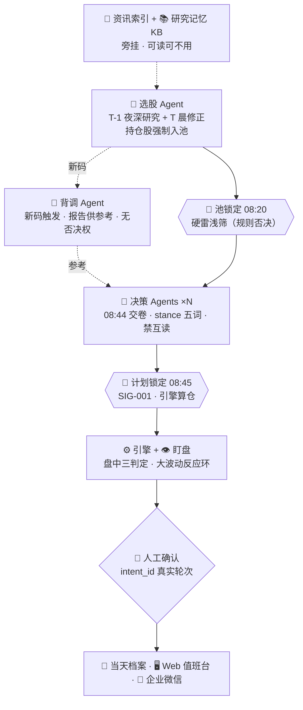

# plan.md — A股值班台（Deep Agents 求职展示项目）实施计划

> **本文件是唯一权威规格。** 实现者（含自动化模型）只按本文件执行。
> 本文件没写的细节：选最简实现，并在 `DECISION-LOG.md` 记一行；**禁止自行扩展功能**。

---

## 0. 给实现者的总守则（先读，违反即返工）

1. **每次只做一个里程碑（M1→M6）**。做完必须跑该里程碑的验收命令，全绿才允许进入下一个。
2. **依赖白名单制**：只允许 §10 列出的依赖。想加新依赖 = 停下，写进 DECISION-LOG 并等人工批准。
3. **命名冻结**：§2 的角色代号、档案文件名、状态机状态名、stance 词表一律不许改、不许加同义词。
4. **禁止事项清单在 §15**，每条都是硬红线。
5. 代码默认不写注释；公共函数写一行 Google-style docstring；类型标注 100%。
6. 每写完一个文件立刻跑 `uv run ruff check . && uv run mypy .`，红了先修再继续。
7. 所有测试用 pytest，测试名必须出现在 §13 清单里（允许加，不允许删/改名）。
8. 本项目**不实跑、不接券商、不联网拉真实行情**。数据源 adapter 一律返回 `examples/` 里的 fixture。
9. 输出给人看的文字用中文；代码标识符用英文。
10. 遇到本规格内部矛盾：以**更保守**（更少权限、更多门禁）的一方为准，并记 DECISION-LOG。

---

## 1. 项目性质与验收总览

- **性质**：GitHub 求职展示项目，参考实现。真实生产系统是另一个仓库，本仓库不复用其代码。
- **一句话定位**：基于 LangGraph Deep Agents 的多智能体 A 股值班系统——研究在盘后、决策在盘前、执行保护在盘中、复盘在盘后；LLM 只产判断不碰钱，每笔订单人工确认；全过程落档案、可回放、可检索。
- **Definition of Done**（2026-09-21 落地核对）：
  - [x] M1–M6 全部验收命令绿
  - [x] `uv run pytest -q` 全绿（162 条）；`ruff`/`mypy` 零告警
  - [ ] GitHub Actions 三个 workflow 绿 —— 仓库尚未推远端，已用本地等价命令全绿；
    另 `lint.yml` 去掉 pre-commit 步骤，只跑白名单工具（见 DECISION-LOG）
  - [x] README 首屏图 = §3 主链图（一字不改，由 `scripts/check_diagram.py` + `test_smoke` 守卫）
  - [x] `examples/replay-2026-09-16/` 可被 `web` 的 Replay 页完整回放
    （`test_replay_expands_every_archive_and_evidence` + `test_examples_match_golden_day_replay`）
  - [x] 脱敏检查脚本 `scripts/check_secrets.py` 通过（§16）

---

## 2. 命名冻结表

### 2.1 角色

| 中文 | 代号（目录/文件名用） | 说明 |
|---|---|---|
| 调度 Agent | `director` | 派活、收卷、写人话文档 |
| 选股 Agent | `screener` | T-1 深研究 + T 晨修正 |
| 资讯 Agent | `news` | 事件索引，旁挂 |
| 背调 Agent | `diligence` | 新码触发，供参考，**无否决权** |
| 决策 Agent | `decision`（多实例 `decision-1/2/3`） | 唯一能变订单 |
| 复核 Agent | `review` | 计划锁定后二审 |
| 盯盘 Agent | `watch` | 盘中监控 + 告警触发 |
| 确定性引擎 | `engine` | 无 LLM，唯一写库 |
| 人工确认 | `human` | 唯一放行口 |

### 2.2 档案文件名（`results/daily/{YYYY-MM-DD}/` 下，一字不改）

```
POOL-DRAFT.md      T-1 选股草稿
PACK.md            采集包（脚本产）
EVENT-INDEX.md     资讯索引
CANDIDATES.md      池终稿
EVIDENCE-{role}.md 取证日志（每角色一份）
DD/{code}/{date}.md 背调报告
DECISION-{tag}.md  决策文件（tag=模型短名）
MORNING.md         计划锁定机器原文
PLAN.md            导演人话计划
REVIEW-{tag}.md    复核
CROSS_EXAM.md      对垒（导演写，只呈现）
NOON.md            午报
INTRADAY.md        盘中追加
INTRADAY-DECISION-{tag}.md 盘中决策提案
SUMMARY.md         日报
EVENTS-POSITIONS.md 持仓事件
ALERT.md           告警档案
```

### 2.3 订单状态机（十态，名字冻结）

```
draft → approved → queued → submitted → filled → partial
                  ↘ rejected        ↘ canceled
                            ↘ expired
                                    ↘ archived
```

- `approved` 给人看写「风控通过，待人工确认」
- `queued` 给人看写「已确认，待提交」
- 状态名是代码标识符，**中文只出现在展示层**。

### 2.4 stance 词表（五词，冻结）

| 词 | 序值 |
|---|---|
| `清仓` | -2 |
| `减仓` | -1 |
| `持有` | 0 |
| `建仓` | +1 |
| `加仓` | +2 |

---

## 3. 架构定稿

### 3.1 主链图（README 首屏原样使用）



### 3.2 一天节奏表

| 时刻 | 动作 | 执行者 |
|---|---|---|
| T-1 23:30 | 选股深研究 → `POOL-DRAFT.md` + 新码清单 | screener |
| T-1 23:40 | 新码背调（夜 ≤2 只，10 交易日有档复用） | diligence |
| T 07:30 | 服务幂等启动 | engine |
| T 07:55 | 导演开机派活；采集脚本产 `PACK.md`；资讯索引 | director / engine / news |
| T 07:55–08:20 | 选股修正 → `CANDIDATES.md`（持仓股强制入池） | screener |
| T 08:00–08:44 | 隔夜突发新码晨补背调（≤2，其余标 `无背调`） | diligence |
| **T 08:20** | **🧊 池锁定**：edge gate + 硬雷浅筛 | engine |
| T 08:20–08:44 | 决策 ×N 并行交卷 `DECISION-{tag}.md` | decision-* |
| **T 08:45** | **🧊 计划锁定**：SIG-001 扫描 → 聚合 → 算仓 → `MORNING.md`；发微信决策卡 | engine |
| T 08:45–09:15 | 复核（禁读 DECISION）→ `REVIEW-{tag}.md`；导演写 `PLAN.md`+`CROSS_EXAM.md` | review / director |
| T 盘中 5min | 腾讯快照三判定（fixture）；保护线走冻结触发线 | engine |
| T 盘中 | 盯盘 6 轮 × 5min → `INTRADAY.md`；大波动(规则) → 导演 → intraday 决策窗口 + 调频 | watch / director / decision |
| T 11:32 / 13:00 | NOON / 下午 watch（稀疏死门） | director |
| T 15:10 | 对账 | engine |
| T 15:12 | `SUMMARY.md` + `EVENTS-POSITIONS.md`；发微信日报 | director |
| T 15:30 | 备份；当日结论性档案增量 ingest 进 KB | engine / memory |

### 3.3 旁挂服务（不在主链，可读可不用）

- `PACK.md` 采集：**脚本**，确定性，无 LLM。来源分级表是配置不是判断。
- `EVENT-INDEX.md`：news agent 把 PACK 读成「事件 → 受影响标的 → 来源 → 时间戳」。
- 研究记忆 KB：见 §6。

### 3.4 输出面

- Web 值班台（§8）、企业微信推送（§9）。两者只读 engine 与档案，**不产生任何写操作**。

---

## 4. 角色规格

> 每个角色 = 一个 `app/src/duty_agent/agents/{role}.py` + 一个提示词常量。
> 通用约束（所有角色）：取证自由（白名单+配额）、采信有门槛（§5.3）、每次工具调用追加 `EVIDENCE-{role}.md`、禁止读其他角色的结论文件、输出禁止仓位字段（§5.4）。

### 4.1 director（调度）
- 时机：07:55 开机；11:32 / 13:00 / 15:12 稀疏死门；被 ALERT 激活。
- 输入：引擎状态、各角色交卷情况。
- 产出：`PLAN.md` `NOON.md` `SUMMARY.md` `EVENTS-POSITIONS.md` `CROSS_EXAM.md`。
- 权限：派活、写人话文档、请求调频。
- 禁区：不产信号、不确认、不加候选、不改触发线、不写仓位数字（引用引擎数字须标「引擎」）。
- 失败处理：某角色 08:44 未交卷 → 记 `ALERT.md` kind=absent，不重试不替补。

### 4.2 screener（选股）
- 时机：T-1 23:30 深研究；T 07:55–08:20 修正。
- 输入：KB recall、PACK/EVENT-INDEX（可选）、自主取证。
- 产出：`POOL-DRAFT.md`（T-1）、`CANDIDATES.md`（T 晨）+ 新码清单（池内且近 10 交易日无 DD 档）。
- 硬规则：**持仓股强制入池，不可剔除**（测试必覆盖）。
- 配额：iFinD ≤8 / 垂搜 ≤12 / 掘金 ≤6（每次会话）。
- 失败处理：配额耗尽 → 基于已有信息出池并打 `LOW_INFO`。

### 4.3 news（资讯）
- 时机：07:55 后，PACK 落盘即跑。
- 产出：`EVENT-INDEX.md`。
- 禁区：不下结论、不产候选、不是闸门（下游可不用）。

### 4.4 diligence（背调）
- 触发：screener 产出新码即激活（T-1 夜为主，T 晨补为辅）。
- 配额：夜 ≤2 只深度；晨补 ≤2；10 交易日有档直接复用不消耗配额。
- 产出：`DD/{code}/{date}.md`；检查项固定七条：质押 / 失信 / 诉讼 / 开庭 / 终本 / 解禁 / 对外担保。
- 权限：**无否决权**。发现硬雷 → 写报告 + 打 `hard_red=true` 标记，由引擎浅筛在次日池锁定执行。
- 覆盖不到的新码：在 `CANDIDATES.md` 对应行标 `无背调`。

### 4.5 decision（决策，多实例）
- 时机：08:20–08:44（盘前窗口）；intraday 窗口（被导演激活）。
- 输入：池（带 `pool_version`）、DD 报告、PACK/EVENT-INDEX（可选）、KB recall、自主取证。
- 产出：`DECISION-{tag}.md`（盘前）/ `INTRADAY-DECISION-{tag}.md`（盘中），格式见 §4.5.1。
- 硬规则：禁互读；08:44 后交卷不计票；盘前可对池内任意码出 stance；**intraday 仅限已持仓/已冻结未成交，禁新码**。
- 冷却（intraday）：同标的 ≤2 次/日，全局 ≤4 次/日；超限只写 `ALERT.md`。
- 聚合在引擎侧（§5.2），decision 不做聚合。

#### 4.5.1 DECISION 文件格式（引擎按此解析，字段缺一即整份作废）

```markdown
# DECISION · {date} · {tag}
as_of: {ISO8601 +08:00}
pool_version: {YYYY-MM-DD-HHMM}

## {code} {name}
stance: {五词之一}
confidence: {high|medium|low}
dd_ref: {DD 路径 | 无背调}
evidence:
  - "[{source}@{time}] {一句话}"
reasoning: {≤3 句}
```

### 4.6 review（复核）
- 时机：计划锁定后。
- 硬规则：**禁读 `DECISION-*.md`**（防锚定；测试用文件访问断言覆盖）。
- 产出：`REVIEW-{tag}.md`；信息不足标 `LOW_INFO`。

### 4.7 watch（盯盘）
- 时机：盘中 6 轮 × 5min；被调频时 1min。
- 输入：仅引擎快照（fixture 腾讯源）。
- 产出：追加 `INTRADAY.md`；触发大波动时写 `ALERT.md` kind=volatility。
- 硬规则：零归因（只记现象不解释原因）；不调用任何 LLM 取证工具。

---

## 5. 关键机制规格

### 5.1 两道冻结墙

- **池锁定 08:20** `engine/freeze.py::lock_pool`
  - 输入：`CANDIDATES.md` 解析结果 + 持仓表 + 硬雷表
  - edge gate：量化门槛（配置项，示例：上市 ≥250 交易日、日均成交额 ≥8000 万、非 ST）
  - 硬雷浅筛（规则否决，非 LLM）：失信被执行 / 终本 / 立案调查 / 质押爆仓线命中 → 移出池并写 `ALERT.md`
  - 产出：`Pool`（含 `pool_version`）
- **计划锁定 08:45** `engine/freeze.py::lock_plan`
  - SIG-001 扫描（§5.4）→ 违规整份作废
  - 聚合（§5.2）→ 目标仓位 bps → 触发线 → `MORNING.md`
  - 此后任何会话无权加候选/定仓/改触发线（代码层：Pool/Plan 对象 frozen dataclass）

### 5.2 stance 聚合 `engine/aggregate.py::aggregate`

- 序轴见 §2.4。
- 同码多实例 stance：极差 ≤1 → 取中位数；极差 ≥2 → 该码回落 `持有` 并记 `conflict=true`。
- 缺卷实例不计票；全体缺卷 → 零候选日（Plan 空）。
- 持仓码聚合结果 `持有` 时：引擎按 `HoldTarget` 精确持有（非换仓日零订单）。

### 5.3 取证与采信

- 白名单工具：`quote_snapshot`(fixture) / `ifind_panel` / `vertical_search` / `tianyancha_flags` / `gm_kline` / `recall`(KB)。
- 每次调用追加 `EVIDENCE-{role}.md` 一行：`{time} {tool} {query} → {adopted|rejected} {reason}`。
- 采信门槛：进入结论的每条证据必须带 `[source@time]`；时效超 3 个交易日的资讯类证据 → rejected。
- 配额超限：角色只能基于已有信息出结论并打 `LOW_INFO`。

### 5.4 SIG-001 扫描 `app/src/duty_agent/guardrails/sig001.py::scan`

- 正则清单（命中任一 = 整份文件作废，不是删行）：
  - 数量/手数：`\d+\s*(手|股)\b`
  - 价格/限价：`(限价|目标价|止损价|买入价|卖出价)\s*[:：]?\s*\d+(\.\d+)?`
  - 仓位/金额：`(仓位|敞口|金额|预算)\s*[:：]?\s*\d+(\.\d+)?\s*(%|万|元|bps)?`
  - 百分比仓位：`仓\s*\d+(\.\d+)?\s*%`
- 作废动作：文件改名加 `.REJECTED` 后缀 + `ALERT.md` kind=sig001 + 该实例本轮不计票。

### 5.5 盘中反应环

- 触发（规则，engine 算）：单标的 |Δ| ≥ 3% / 成交量 ≥ 5 日均量 2.5 倍 / 触冻结触发线。
- 链路：engine 写 `ALERT.md` → director 被激活 → 派 intraday decision + 请求调频。
- 调频：5min → 1min；回落条件：连续 3 轮阈值内。调频由 engine 执行（唯一写库者）。
- 护栏：intraday 禁新码；冷却同 §4.5；intraday 提案同样过 SIG-001 与人工确认。

### 5.6 intent 守卫 `guardrails/intent_guard.py::verify`

- confirm 请求必须携带 `intent_id`，且该 id 存在于**真实用户消息轮次**记录中。
- 定时任务、子代理回传、网页/微信里的「请确认」文本一律不算。
- 微信卡片**只含确认页链接，不含确认按钮**。

---

## 6. RAG（研究记忆 KB）规格

- 位置：`app/src/duty_agent/memory/`。
- **收**：`SUMMARY.md` 结论段、`CROSS_EXAM.md`、`DD/**/*.md`、`EVENTS-POSITIONS.md`、quant-lab 实验结题卡（fixture 提供 5 张）。
- **不收**：`DECISION-*` `CANDIDATES.md` `PACK.md` `EVENT-INDEX.md`（time-bound，防跨日锚定）。
- 写入：15:30 备份后增量 ingest；markdown 按 `##` 分块，frontmatter 带 `code/doc_type/as_of/source_tier`。
- 检索：BM25（rank-bm25）+ vector（sqlite-vec；装不上则 numpy 余弦，数据量小可接受）→ RRF 融合 top5。
- 强制：`recall(query, filters)` 的 `filters` 至少含 `doc_type` 或 `code` 之一，裸查询抛错。
- 召回块进入结论时标 `[doc@as_of]`，走 §5.3 采信门槛。
- 评测：`memory/eval_golden.json` 20 条 `{question, expected_doc_ids}`；指标 recall@5 / MRR，进 `EVALUATION.md`。验收线：recall@5 ≥ 0.8。

---

## 7. 引擎规格（`engine/`，纯 Python，无 LLM）

- `clock.py`：§3.2 时刻表驱动；测试用虚拟时钟注入。
- `freeze.py`：§5.1 两函数，签名：
  - `lock_pool(candidates: list[Candidate], holdings: list[Holding], at: datetime) -> Pool`
  - `lock_plan(decisions: list[DecisionFile], pool: Pool, at: datetime) -> Plan`
- `aggregate.py`：§5.2 `aggregate(stances: dict[str, list[Stance]]) -> dict[str, Aggregated]`
- `orders.py`：§2.3 十态状态机；非法转移抛 `IllegalTransition`；转移矩阵写成表驱动 + 全矩阵测试。
- `ledger.py`：**金额内部一律整数分**；仓位 bps 整数；禁止 float 参与金额运算（mypy + 测试断言）。
- `monitor.py`：三判定（fixture 腾讯快照）；保护线判定只读冻结触发线。
- `push_dispatcher.py`：§9 四类卡片的事件分发；渲染模板在 `app/.../notify/cards.py`。
- 存储：SQLite（`orders` `ledger` `alerts` 三表）+ 文件系统档案。

---

## 8. Web 值班台（Streamlit，`web/`）

| 页 | 文件 | 必备内容 |
|---|---|---|
| Board | `web/pages/board.py` | 当日节奏表进度、池/锁定状态、订单十态看板、引擎数字（标「引擎」） |
| Replay | `web/pages/replay.py` | 选日期 → 按时间展开全部档案 + 每角色 EVIDENCE 链 |
| Confirm | `web/pages/confirm.py` | approved 列表；引擎数字与 agent 评论**分栏**；intent_id 输入框（唯一放行口） |
| KB | `web/pages/kb.py` | 检索框 + metadata filter + 召回块带 `[doc@as_of]` |
| Evals | `web/pages/evals.py` | 测试数、覆盖率、recall@5/MRR、已关闭实验轴清单 |

- 确认页提交 = 产生一条真实用户轮次记录 → 满足 §5.6。
- 所有页面只读；无任何写库入口（除 confirm 走 engine API）。

---

## 9. 企业微信推送（`notify/`）

| 卡片 | 触发 | 内容字段 | 上限 |
|---|---|---|---|
| 早盘决策卡 | 计划锁定 | 池列表、每码 stance、引擎触发线、agent 理由摘要（标「评论」）、确认页链接 | 1/日 |
| 波动提案 | intraday 提案产出 | 标的、规则触发原因、stance 提案、确认页链接 | ≤4/日 |
| 日报 | 15:12 | 引擎盈亏、执行回顾、明日关注、档案链接 | 1/日 |
| 告警 | 失租/拉价失败/SIG-001 作废/缺卷/硬雷 | 类型、影响面、处置建议 | 不限 |

- 数字一律 engine 出；agent 文字一律标「评论」。
- **卡片不含确认按钮**。
- 展示模式：webhook 未配置时写 `outbox/{ts}.md` 落盘（测试断言用）。

---

## 10. 技术栈与依赖白名单

| 用途 | 依赖 | 版本约束 |
|---|---|---|
| 运行时 | python | ==3.11.* |
| 包管理 | uv workspace（`app` + `engine` 两 member） | 最新稳定 |
| agent 框架 | `langgraph` `deepagents` `langchain-core` | 最新稳定 |
| MCP | `langchain-mcp-adapters` | 最新稳定 |
| RAG | `sqlite-vec`（fallback numpy） `rank-bm25` | — |
| web | `streamlit` | ≥1.40 |
| 推送 | `requests` | — |
| 配置 | `pydantic-settings` | — |
| 测试/质量 | `pytest` `pytest-cov` `ruff` `mypy` | — |

**白名单外一律禁止。** LLM 调用在展示模式走 `FakeChatModel`（langchain-core 自带），配置里留真实模型占位但不启用。

---

## 11. 仓库结构与文件清单

```
astock-duty-officer/
├── plan.md                      # 本文件
├── README.md                    # M6 写；首屏图=§3.1
├── ARCHITECTURE.md              # M1 写：主链图+节奏表+旁挂说明
├── SAFETY.md                    # M1 写：§15 红线 + 威胁模型 + RAG 不用在行情的理由
├── EVALUATION.md                # M4/M6 填：测试数/覆盖率/recall@5/MRR
├── DECISION-LOG.md              # 持续追加，一行一条
├── CHANGELOG.md  LICENSE  .env.example  .gitignore
├── pyproject.toml               # workspace 根
├── .github/workflows/{ci,lint,docs}.yml
├── app/
│   ├── pyproject.toml
│   └── src/duty_agent/
│       ├── graph.py             # create_deep_agent 主图；subagents 注入
│       ├── planner.py           # 派活顺序（§3.2）
│       ├── config.py            # pydantic-settings；配额/阈值/时刻表
│       ├── agents/{director,screener,news,diligence,decision,review,watch}.py
│       ├── guardrails/{sig001,hard_red,source_adjudicator,intent_guard}.py
│       ├── memory/{ingest,store,recall_tool,eval_golden.json,eval.py}
│       └── notify/{wecom,cards}.py
├── engine/
│   ├── pyproject.toml
│   └── src/duty_engine/{clock,freeze,aggregate,orders,ledger,monitor,push_dispatcher,storage}.py
├── web/{app.py,pages/{board,replay,confirm,kb,evals}.py}
├── examples/replay-2026-09-16/  # 脱敏全天档案 + fixtures/（行情/财务/背调 mock）
├── scripts/check_secrets.py
└── tests/                       # 镜像 app/engine 结构
```

---

## 12. 里程碑（严格按序）

### M1 骨架与文档（验收：`uv run pytest -q` 绿且 ≥1 smoke；ruff/mypy 零告警；CI 绿）
1. `uv init` workspace + 两 member + 全部目录
2. 写 ARCHITECTURE.md / SAFETY.md / DECISION-LOG.md / .env.example / LICENSE(MIT) / CHANGELOG.md
3. 三个 workflow + pre-commit 配置
4. `tests/test_smoke.py`

### M2 引擎（验收：§13 引擎测试全绿）
1. storage 三表 + ledger（分整数断言）
2. orders 十态 + 全转移矩阵测试
3. clock 虚拟时钟 + freeze 两墙 + aggregate
4. monitor 三判定（fixture）+ push_dispatcher（outbox 落盘）

### M3 agent 层（验收：golden-day 回放测试绿：喂 `examples/replay-2026-09-16/fixtures` → 断言 CANDIDATES/DECISION/MORNING 字段齐全；SIG-001 作废测试绿；review 禁读断言绿）
1. graph + planner + config
2. 七角色（FakeChatModel 驱动，提示词常量）
3. guardrails 四件 + EVIDENCE 追加
4. intent_guard + confirm 链路（web confirm 页的 API 部分）

### M4 记忆（验收：recall@5 ≥ 0.8 且 `memory/eval.py` 输出进 EVALUATION.md）
1. ingest（分块+frontmatter）+ store + recall_tool（强制 filter）
2. eval_golden.json 20 条 + eval.py

### M5 输出面（验收：`streamlit run web/app.py` 起得来；五页快照测试绿；四类卡片 outbox 快照含引擎数字且不含 LLM 仓位字段）
1. web 五页
2. notify 四卡片模板

### M6 收尾（验收：§1 全 DoD 勾完；`scripts/check_secrets.py` 通过）
1. README（首屏 §3.1 图 + 节奏表 + 三段叙事）
2. docs/demo-script.md（3 分钟讲解动线）
3. 徽章、examples 回放校验、脱敏终检

---

## 13. 测试清单（名字冻结，允许加不允许删）

引擎：`test_ledger_cents_only` `test_orders_full_transition_matrix` `test_orders_illegal_transition_raises` `test_lock_pool_hard_red_veto` `test_lock_pool_holdings_forced_in` `test_lock_plan_sig001_rejects_whole_file` `test_aggregate_range_le1_median` `test_aggregate_range_ge2_falls_back_hold` `test_aggregate_all_absent_zero_day` `test_monitor_protection_uses_frozen_line` `test_push_outbox_fallback`
agent：`test_decision_no_cross_read` `test_decision_late_submission_not_counted` `test_intraday_forbids_new_code` `test_intraday_cooldown_limits` `test_review_cannot_read_decision` `test_screener_holdings_forced_in` `test_evidence_appended_per_tool_call` `test_intent_guard_rejects_non_user_turn` `test_watch_zero_attribution` `test_golden_day_replay`
memory：`test_recall_requires_filter` `test_ingest_excludes_time_bound_docs` `test_recall_eval_threshold`
web/notify：`test_card_numbers_from_engine_only` `test_card_has_no_confirm_button` `test_confirm_page_creates_user_turn`

---

## 14. 风格规范

- ruff：line-length 100，rules `E,F,I,UP,B`；mypy：`strict = true`
- docstring：Google style，公共函数一行
- commit：Conventional Commits（`feat(engine): ...`）
- 金额变量名带单位：`amount_cents` `position_bps`
- 时间一律 `datetime` + `ZoneInfo("Asia/Shanghai")`，禁止 naive datetime

---

## 15. 禁止事项（红线）

1. 自动下单 / 接券商通道 / 实现 `execute_protective_path` 类跳过确认的接口
2. LLM 输出或卡片出现仓位字段（数量/价格/仓位/限价/止损/手数/金额）
3. RAG 检索行情或新闻
4. intraday 窗口引入新码
5. agent 挂钟（所有定时归 engine/cron）
6. 微信卡片内确认按钮
7. 删档案 / 覆盖历史档案（只追加；作废用 `.REJECTED` 后缀）
8. 白名单外依赖
9. float 参与金额运算
10. 改 §2 任何冻结名
11. 联网拉真实行情/真实密钥（展示模式全 fixture）
12. 为「看起来完整」而加规格外功能

---

## 16. 脱敏清单（`scripts/check_secrets.py` 断言）

- 无 API key / token / webhook 真实值（正则扫全仓）
- 无绝对路径含用户名
- 账户参数仅示例值（`PORTFOLIO_CENTS=100000000` 等）
- fixtures 中持仓金额为示例值
- `.env.example` 只含占位符

---

## 17. 参考映射（只读语义，不抄代码）

| 本仓库 | 原系统对应物（语义来源） |
|---|---|
| 十态状态机 / 分整数账本 | `炒股/v3/src/astock3/orders,ledger` |
| 冻结与门禁思想 | `炒股/v3/src/astock3/pipeline,rules` |
| 已关闭实验轴（KB fixture） | `炒股/quant-lab/experiments/`（0008 反转、动量五次确认、0018 TOM 复现） |
| 背调七条 | `炒股/zcode-plugin` dd skill 方法论 |
